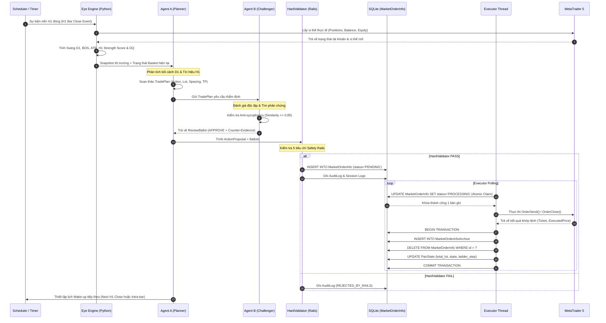
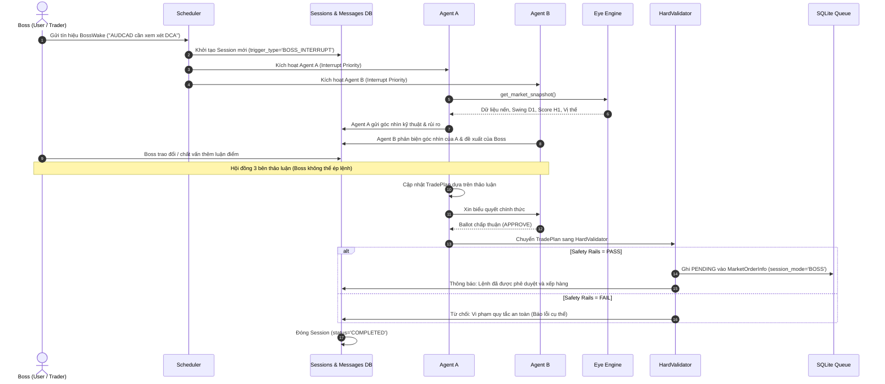
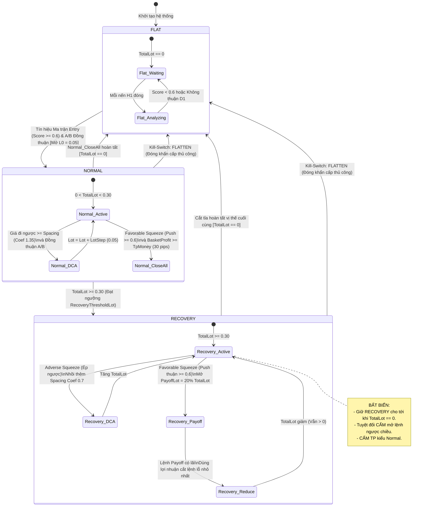
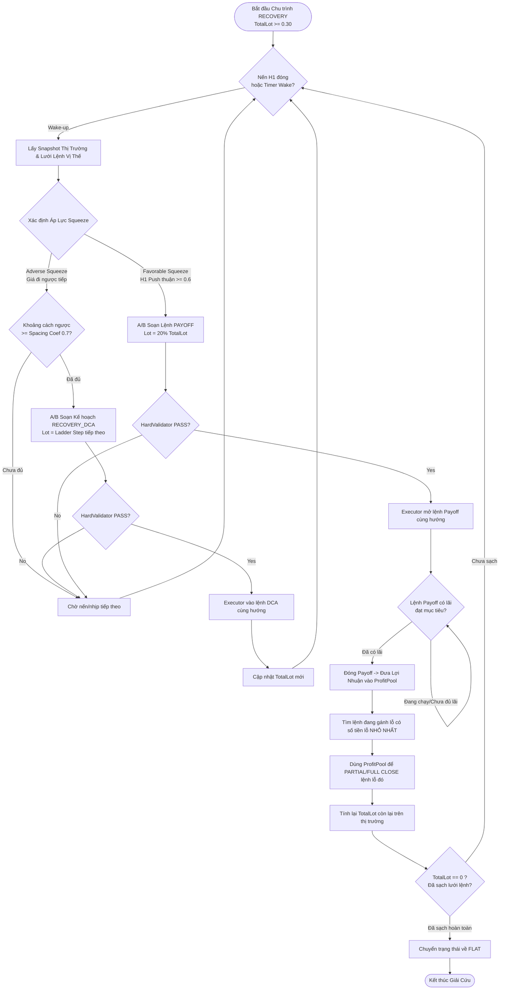
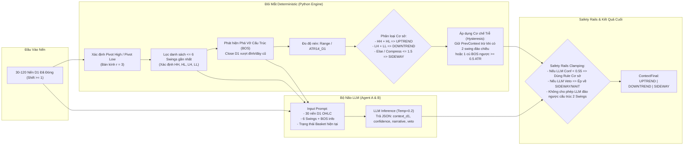
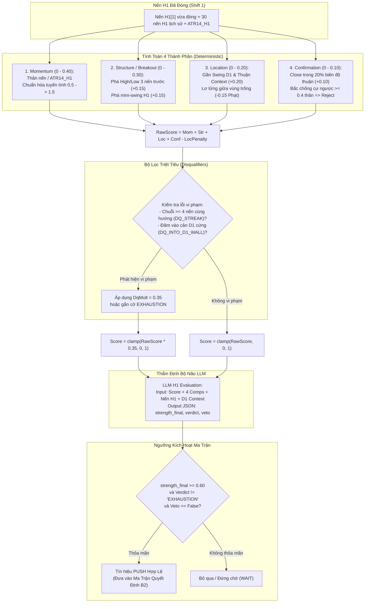
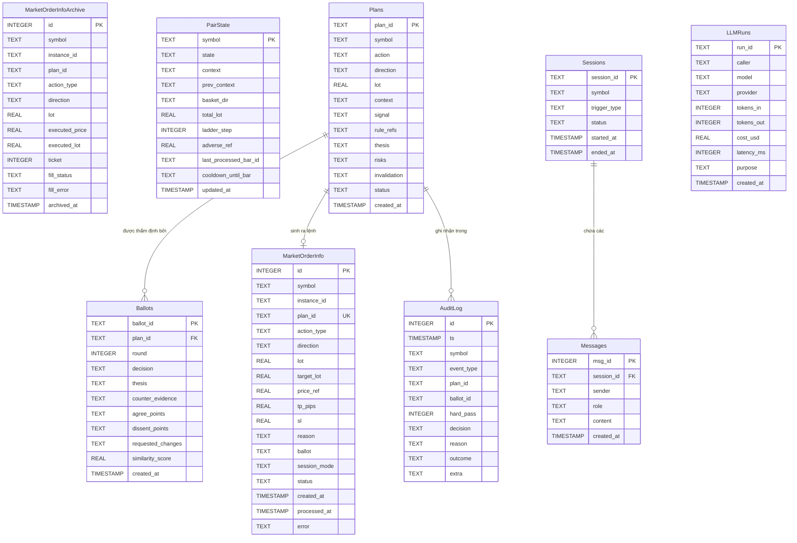
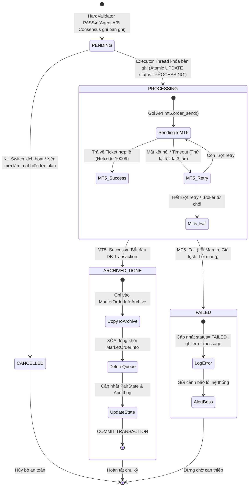

# HỆ THỐNG TRADING AGENT DCA (MT5 / PYTHON)
## TÀI LIỆU THIẾT KẾ KIẾN TRÚC HOÀN CHỈNH (SYSTEM DESIGN DOCUMENT)
**Bản chính thức (Official Release) — Thay thế toàn bộ các bản thiết kế trước**

---

## MỤC LỤC
1. [PHẦN A — MÔ HÌNH INSTANCE & HẠ TẦNG](#phần-a--mô-hình-instance--hạ-tầng)
2. [PHẦN B — CHIẾN LƯỢC GIAO DỊCH CORE](#phần-b--chiến-lược-giao-dịch-core)
3. [PHẦN C — D1 CONTEXT: ĐỌC CẤU TRÚC GIÁ KIỂU MẮT NGƯỜI](#phần-c--d1-context-đọc-cấu-trúc-giá-kiểu-mắt-người)
4. [PHẦN D — H1 SIGNAL: BỘ ĐO LỰC NẾN & ĐIỂM SỐ 0–1](#phần-d--h1-signal-bộ-đo-lực-nến--điểm-số-01)
5. [PHẦN E — KIẾN TRÚC 3 LỚP & LUỒNG THI HÀNH](#phần-e--kiến-trúc-3-lớp--luồng-thi-hành)
6. [PHẦN F — DATABASE SCHEMA & HÀNG ĐỢI GIAO DỊCH SQLITE](#phần-f--database-schema--hàng-đợi-giao-dịch-sqlite)
7. [PHẦN G — CƠ CHẾ ĐỒNG THUẬN AGENT A/B & KÊNH BOSS INTERRUPT](#phần-g--cơ-chế-đồng-thuận-agent-ab--kênh-boss-interrupt)
8. [PHẦN H — ĐỘNG CƠ SCHEDULER & CƠ CHẾ WAKE-UP](#phần-h--động-cơ-scheduler--cơ-chế-wake-up)
9. [PHẦN I — BẢNG THAM SỐ TOÀN DIỆN & CẤU HÌNH LLM](#phần-i--bảng-tham-số-toàn-diện--cấu-hình-llm)
10. [PHẦN J — TẬP HỢP 9 MERMAID DIAGRAMS HOÀN CHỈNH](#phần-j--tập-hợp-9-mermaid-diagrams-hoàn-chỉnh)
11. [PHẦN K — QUYẾT ĐỊNH THIẾT KẾ MỞ & LỘ TRÌNH TRIỂN KHAI](#phần-k--quyết-định-thiết-kế-mở--lộ-trình-triển-khai)

---

# PHẦN A — MÔ HÌNH INSTANCE & HẠ TẦNG

1. **Kiến trúc Single-Pair Instance:**
   - Mỗi cặp tiền tệ ($Symbol$) được cô lập hoàn toàn thành **1 Process / Instance riêng biệt**, sở hữu:
     - **Engine Deterministic (Python):** Tính toán nến, swing, score, validator, safety rails.
     - **Agent A (Planner-Executor):** Đề xuất kế hoạch, phân tích bối cảnh, soạn lệnh.
     - **Agent B (Independent Challenger):** Thẩm định độc lập, tìm phản chứng (*counter-evidence*), chống thiên vị (*anti-sycophancy*).
     - **1 Executor Thread:** Luồng nền Python độc quyền tương tác trực tiếp với API MetaTrader 5 (MT5). Không agent nào được gọi `OrderSend()` trực tiếp.
     - **1 Database SQLite riêng biệt:** `dca_<symbol>.db` (chạy WAL mode).
2. **Khả năng mở rộng đa cặp (Multi-pair Scaling):**
   - Vận hành $N$ cặp = Bật $N$ process độc lập song song. Không chia sẻ state bộ nhớ giữa các cặp.
   - **Bỏ Global Direction Lock:** Mỗi cặp tự do Buy/Sell theo logic riêng mà không bị ràng buộc lẫn nhau.
   - **Lộ trình Pilot:** Test trước trên 2 cặp kiểm soát chi phí LLM (`AUDCAD`, `AUDNZD`), sau đó mở rộng sang `GBPUSD`, `NZDCAD`.

---

# PHẦN B — CHIẾN LƯỢC GIAO DỊCH CORE

### B1. Khung thời gian & Nguyên tắc không Repaint
- **D1 (Daily):** Đóng vai trò bộ lọc xu hướng/bối cảnh (*Context Filter*). Sử dụng nến D1 **đã đóng hoàn toàn** ($D1[1]$).
- **H1 (1-Hour):** Đóng vai trò tín hiệu vào lệnh (*Signal Trigger*). Duyệt quyết định tại thời điểm nến H1 **vừa đóng** ($H1[1]$).
- **Tuyệt đối không repaint:** Cấm đọc nến đang chạy ($shift = 0$) để sinh tín hiệu; Pivot D1 chỉ được xác nhận sau khi có đủ 3 nến D1 phía sau.
- **Thực thi lệnh:** Vào lệnh thị trường (**MARKET order**) ngay khi nến H1 đóng nếu có tín hiệu thỏa mãn + A/B đồng thuận + Safety Rails PASS.

### B2. Ma trận Quyết định Vào Lệnh (FLAT $\to$ NORMAL Entry)
$$\text{Điều kiện vào lệnh}: \text{StrengthScore} \ge 0.6 \land \text{LLM Verdict} \ne \text{"EXHAUSTION"} \land \text{HardValidator} = \text{PASS}$$

| Bối cảnh D1 (D1 Context) | H1 PUSH Đi Xuống ($\text{Score} \ge 0.6$) | H1 PUSH Đi Lên ($\text{Score} \ge 0.6$) |
|:---|:---|:---|
| **UPTREND** | **MUA** (*Buy the Dip*) | Đứng chờ (CẤM BÁN) |
| **DOWNTREND** | Đứng chờ (CẤM MUA) | **BÁN** (*Sell the Rally*) |
| **SIDEWAY** | **MUA** (*Fade đáy hỗ trợ*) | **BÁN** (*Fade đỉnh kháng cự*) |

*Nếu $\text{StrengthScore} < 0.6$ hoặc có Veto/Neutral/Exhaustion $\implies$ **WAIT** (Không vào lệnh).*

### B3. Quản lý Vốn & Bậc Thang Lot (Lot Ladder)
- **Vốn tham chiếu:** $1,000 USD.
- **Lot khởi điểm:** $L_0 = \text{BeginLot} = 0.05$.
- **Bước tăng lot:** $\Delta L = \text{LotStep} = 0.05$. Bậc thang: $0.05 \to 0.10 \to 0.15 \to 0.20 \to 0.25 \to \dots$ (Không giới hạn trần lot cứng $\text{MaxLot}=0$).
- **Khoảng cách nhồi lệnh (Spacing):**
  $$\text{Spacing}(\text{pips}) = \max\Big(\text{MinSpacingPips}=15,\; \text{Coef} \times \text{ATR14\_H1}\Big)$$
  - $\text{Coef}_{\text{NORMAL}} = 1.2 \sim 1.5$ (Mặc định: $1.35$).
  - $\text{Coef}_{\text{RECOVERY}} = 0.7$ (Hoặc khi Strong Trend ngược).
- **Chốt lời Basket (Basket TP NORMAL):** $TP_{\text{Pips}} = 30\text{ pips}$.
  $$TP_{\text{Money}} = TP_{\text{Pips}} \times \text{PipValue} \times \text{TotalLot}$$

### B4. State Machine của Từng Cặp
Hệ thống chuyển trạng thái theo chu trình: $\text{FLAT} \longrightarrow \text{NORMAL} \longrightarrow \text{RECOVERY} \longrightarrow \text{FLAT}$.

1. **Trạng thái FLAT:**
   - $\text{TotalLot} = 0$. Chờ tín hiệu từ ma trận bối cảnh D1 + H1 close.
2. **Trạng thái NORMAL ($0 < \text{TotalLot} < 0.30$):**
   - DCA nhồi thêm lệnh cùng hướng khi giá đi ngược đủ khoảng cách $\text{Spacing}$.
   - Chốt lời toàn bộ (**CLOSE_ALL**) khi có **Favorable Squeeze** (H1 Push thuận $\ge 0.6$) VÀ $\text{BasketProfit} \ge TP_{\text{Money}}$.
   - Nếu $\text{TotalLot} \ge 0.30 \implies$ Chuyển sang **RECOVERY**.
3. **Trạng thái RECOVERY ($\text{TotalLot} \ge 0.30$):**
   - **Bất biến:** Giữ nguyên trạng thái RECOVERY cho tới khi sạch hoàn toàn ($\text{TotalLot} = 0$), kể cả khi lot tạm thời giảm xuống dưới $0.30$.
   - **Ép ngược (Adverse Squeeze):** Nhồi tiếp $\text{RECOVERY\_DCA}$ cùng hướng theo $\text{Coef} = 0.7$.
   - **Ép thuận (Favorable Squeeze):** Mở lệnh giải cứu $\text{PayoffLot} = 20\%$ của $\text{TotalLot}$ (từ $15\% \sim 30\%$).
     - Khi lệnh Payoff có lãi $\implies$ Dùng toàn bộ lợi nhuận từ $\text{PayoffLot}$ để đóng/cắt tỉa (**PARTIAL_CLOSE / FULL_CLOSE**) các lệnh đang gánh lỗ (ưu tiên cắt lệnh có số tiền lỗ nhỏ nhất trước để giải phóng margin nhanh nhất).
     - Lặp lại quy trình cho đến khi $\text{TotalLot} = 0 \implies$ Quay về **FLAT**.
   - **Cấm kỵ trong RECOVERY:** Tuyệt đối cấm mở lệnh ngược hướng, cấm TP theo kiểu NORMAL, cấm cắt lỗ hoảng loạn (*max-drawdown stop*), cấm tự động tụt về NORMAL.

---

# PHẦN C — D1 CONTEXT: ĐỌC CẤU TRÚC GIÁ KIỂU MẮT NGƯỜI

### C1. Đôi Mắt Deterministic (Python Engine)
- **Thuật toán Swing Pivot D1:** Bán kính $r = 3$. Một đỉnh/đáy được xác nhận là Pivot khi cao hơn/thấp hơn 3 nến D1 trước và 3 nến D1 sau. Chỉ giữ tối đa 6 swings gần nhất.
- **Trích xuất đặc trưng (Features):**
  - Trạng thái đỉnh/đáy: $HH, HL, LH, LL$.
  - Điểm phá vỡ cấu trúc (**BOS - Break of Structure**): Khi giá đóng cửa $D1[1]$ vượt qua Pivot gần nhất.
  - Tỷ lệ nén biên độ: $\text{range\_compress} = \frac{|\text{SwingHigh} - \text{SwingLow}|}{\text{ATR14\_D1}}$.
- **Quy tắc phân loại Safety Rails cơ sở:**
  - $\text{UPTREND} \iff 2\text{ PH tăng} + 2\text{ PL tăng } (HH+HL) \land \text{chưa có Down-BOS sau đó}$.
  - $\text{DOWNTREND} \iff 2\text{ PH giảm} + 2\text{ PL giảm } (LH+LL) \land \text{chưa có Up-BOS sau đó}$.
  - $\text{SIDEWAY} \iff \text{Các trường hợp còn lại hoặc } \text{range\_compress} \le 1.5$.
- **Cơ chế trễ (Hysteresis):** Giữ nguyên $\text{PrevContext}$ trừ khi xuất hiện $2$ swings cùng dấu liên tiếp hoặc $1$ cú BOS ngược cực mạnh ($\text{Close D1 vượt Pivot} \ge 0.5 \times \text{ATR14\_D1}$).

### C2. Bộ Não LLM & Safety Rails Clamping
- LLM (Agent A & B) nhận đầu vào: 30 nến D1 OHLC đã đóng + danh sách $\le 6$ swings + các chỉ số nén/BOS.
- LLM trả về JSON: `context_d1`, `confidence`, `narrative`, `veto`.
- **Nguyên tắc:** LLM chỉ được phân tích, không được tự bịa ra swing. Quyết định cuối cùng được ép qua **Safety Rails Clamp**: Nếu LLM mâu thuẫn với cấu trúc hình học mà không có luận điểm vững chắc, hệ thống ưu tiên quy tắc an toàn.

---

# PHẦN D — H1 SIGNAL: BỘ ĐO LỰC NẾN & ĐIỂM SỐ 0–1

### D1. Công thức Tính Điểm Sức Mạnh (Strength Score)
$$\text{RawScore} = W_{\text{Mom}} \cdot \text{Mom} + W_{\text{Str}} \cdot \text{Str} + W_{\text{Loc}} \cdot \text{Loc} + W_{\text{Conf}} \cdot \text{Conf}$$
$$\text{StrengthScore} = \text{clamp}\Big((\text{RawScore} - \text{LocPenalty}) \times \text{DQ\_Multiplier},\; 0,\; 1\Big)$$

Trong đó trọng số: $W_{\text{Mom}} = 0.40,\; W_{\text{Str}} = 0.30,\; W_{\text{Loc}} = 0.20,\; W_{\text{Conf}} = 0.10$.
1. **Momentum Component ($\text{Mom} \in [0, 0.40]$):**
   - Đo tỷ lệ thân nến $H1[1]$ so với $\text{ATR14\_H1}$. Chuẩn hóa tuyến tính từ $0.5 \to 1.5$ với trần $K_S = 1.5$.
2. **Structure / Breakout Component ($\text{Str} \in [0, 0.30]$):**
   - Close $H1[1]$ phá vỡ High/Low của 3 nến trước ($+0.15$) và/hoặc phá vỡ mini-swing H1 ($+0.15$).
3. **Location Component ($\text{Loc} \in [0, 0.20]$, có phạt):**
   - Ép thuận bối cảnh D1 và gần vùng Swing D1 ($\le 1.5 \times \text{ATR14\_D1}$) $\implies +0.20$.
   - Ép lơ lửng giữa vùng chân không $\implies \text{LocPenalty} = 0.15$.
4. **Confirmation Component ($\text{Conf} \in [0, 0.10]$):**
   - Giá đóng cửa nằm trong $20\%$ biên độ cực trị thuận $\implies +0.10$.
   - Bấc nến chống cự ngược $\ge 0.4 \times \text{Thân nến} \implies \text{Conf} = 0$ và kích hoạt cờ Reject.
5. **Bộ lọc Triệt Tiêu (Disqualifiers - DQ):**
   - Kích hoạt $\text{DQ\_Multiplier} = 0.35$ hoặc gán nhãn `EXHAUSTION` khi:
     - Đã có chuỗi $\ge 4$ nến H1 liên tiếp cùng hướng ($\text{DQ\_STREAK}$).
     - Đâm thẳng vào cản D1 cứng mà chưa có nến bứt phá ($\text{DQ\_INTO\_D1\_WALL}$).

---

# PHẦN E — KIẾN TRÚC 3 LỚP & LUỒNG THI HÀNH

```
┌────────────────────────────────────────────────────────────────────────┐
│                   LỚP 2: BỘ NÃO LLM (COGNITIVE LAYER)                  │
│   ┌──────────────────────────┐        ┌──────────────────────────┐    │
│   │   AGENT A: PLANNER       │◄──────►│  AGENT B: CHALLENGER     │    │
│   │   - Phân tích D1/H1      │  Đồng  │  - Độc lập thẩm định     │    │
│   │   - Lập TradePlan        │  thuận │  - Bắt buộc phản biện    │    │
│   └─────────────┬────────────┘        └─────────────┬────────────┘    │
│                 │                                   │                 │
│                 └─────────────────┬─────────────────┘                 │
│                                   ▼                                   │
│                          ActionProposal / Ballot                      │
└───────────────────────────────────┼───────────────────────────────────┘
                                    │
                                    ▼
┌─────────────────────────────────────────────────────────────────────────┐
│                   LỚP 3: SAFETY RAILS & HARD VALIDATOR                  │
│   - Kiểm tra Ma trận D1/H1               - Kiểm tra Spacing tối thiểu   │
│   - Kiểm tra Bậc thang Lot               - RECOVERY: Cấm mở ngược chiều │
│   - Khớp bước Lot của Broker             - Kill-Switch (PAUSE/FLATTEN)  │
│   => BẮT BUỘC PASS 100% TRƯỚC KHI GHI VÀO HÀNG ĐỢI                     │
└───────────────────────────────────┼─────────────────────────────────────┘
                                    │ Ghi dòng PENDING
                                    ▼
┌─────────────────────────────────────────────────────────────────────────┐
│                   LỚP 1: ENGINE MẮT & EXECUTOR THREAD                   │
│   ┌─────────────────────────────────────────────────────────────────┐   │
│   │ SQLite Queue: MarketOrderInfo (Chống Race-condition qua WAL)    │   │
│   └───────────────────────────────┬─────────────────────────────────┘   │
│                                   │ Claim PROCESSING (Atomic)           │
│                                   ▼                                     │
│   ┌─────────────────────────────────────────────────────────────────┐   │
│   │ EXECUTOR THREAD (Luồng Python độc quyền kết nối MetaTrader 5)   │   │
│   │ - OrderSend() / PositionClose()                                 │   │
│   │ - Xóa hàng đợi & Archive transaction                            │   │
│   │ - Cập nhật PairState & AuditLog                                 │   │
│   └───────────────────────────────┬─────────────────────────────────┘   │
└───────────────────────────────────┼─────────────────────────────────────┘
                                    │ Socket / IPC
                                    ▼
                     ┌─────────────────────────────┐
                     │     METATRADER 5 TERMINAL   │
                     │  (Nguồn Chân Lý Vị Thế Mở)  │
                     └─────────────────────────────┘
```

---

# PHẦN F — DATABASE SCHEMA & HÀNG ĐỢI GIAO DỊCH SQLITE

Toàn bộ dữ liệu của mỗi instance được lưu tại file `dca_<symbol>.db` với cấu hình bắt buộc:
```sql
PRAGMA journal_mode = WAL;
PRAGMA busy_timeout = 5000;
PRAGMA foreign_keys = ON;
PRAGMA synchronous = NORMAL;
```

### Chi tiết DDL 8 Bảng Dữ Liệu:

```sql
-- 1. Hàng đợi lệnh chờ Executor xử lý
CREATE TABLE MarketOrderInfo (
    id INTEGER PRIMARY KEY AUTOINCREMENT,
    symbol TEXT NOT NULL,
    instance_id TEXT NOT NULL,
    plan_id TEXT UNIQUE NOT NULL,
    action_type TEXT NOT NULL CHECK(action_type IN ('OPEN','DCA','PAYOFF','CLOSE_ALL','PARTIAL_CLOSE')),
    direction TEXT NOT NULL CHECK(direction IN ('BUY','SELL')),
    lot REAL NOT NULL,
    target_lot REAL,
    price_ref REAL NOT NULL,
    tp_pips REAL,
    sl REAL,
    reason TEXT NOT NULL,
    ballot TEXT NOT NULL,
    session_mode TEXT NOT NULL CHECK(session_mode IN ('AUTO','BOSS')),
    status TEXT NOT NULL DEFAULT 'PENDING' CHECK(status IN ('PENDING','PROCESSING','DONE','FAILED','CANCELLED')),
    created_at TIMESTAMP DEFAULT CURRENT_TIMESTAMP,
    processed_at TIMESTAMP,
    error TEXT
);

-- 2. Bảng lưu trữ lịch sử lệnh đã thực thi xong
CREATE TABLE MarketOrderInfoArchive (
    id INTEGER PRIMARY KEY,
    symbol TEXT NOT NULL,
    instance_id TEXT NOT NULL,
    plan_id TEXT NOT NULL,
    action_type TEXT NOT NULL,
    direction TEXT NOT NULL,
    lot REAL NOT NULL,
    executed_price REAL NOT NULL,
    executed_lot REAL NOT NULL,
    ticket INTEGER NOT NULL,
    fill_status TEXT NOT NULL,
    fill_error TEXT,
    archived_at TIMESTAMP DEFAULT CURRENT_TIMESTAMP
);

-- 3. Trạng thái Runtime của cặp tiền
CREATE TABLE PairState (
    symbol TEXT PRIMARY KEY,
    state TEXT NOT NULL CHECK(state IN ('FLAT','NORMAL','RECOVERY')),
    context TEXT NOT NULL CHECK(context IN ('UPTREND','DOWNTREND','SIDEWAY')),
    prev_context TEXT NOT NULL,
    basket_dir TEXT CHECK(basket_dir IN ('BUY','SELL', NULL)),
    total_lot REAL DEFAULT 0.0,
    ladder_step INTEGER DEFAULT 0,
    adverse_ref REAL DEFAULT 0.0,
    last_processed_bar_id TEXT NOT NULL,
    cooldown_until_bar TEXT,
    updated_at TIMESTAMP DEFAULT CURRENT_TIMESTAMP
);

-- 4. Nhật ký kiểm toán toàn diện
CREATE TABLE AuditLog (
    id INTEGER PRIMARY KEY AUTOINCREMENT,
    ts TIMESTAMP DEFAULT CURRENT_TIMESTAMP,
    symbol TEXT NOT NULL,
    event_type TEXT NOT NULL,
    plan_id TEXT,
    ballot_id TEXT,
    hard_pass INTEGER NOT NULL,
    decision TEXT NOT NULL,
    reason TEXT NOT NULL,
    outcome TEXT,
    extra TEXT -- JSON
);

-- 5. Kế hoạch giao dịch của Agent A
CREATE TABLE Plans (
    plan_id TEXT PRIMARY KEY,
    symbol TEXT NOT NULL,
    action TEXT NOT NULL,
    direction TEXT NOT NULL,
    lot REAL NOT NULL,
    context TEXT NOT NULL, -- JSON
    signal TEXT NOT NULL,  -- JSON
    rule_refs TEXT NOT NULL,
    thesis TEXT NOT NULL,
    risks TEXT NOT NULL,
    invalidation TEXT NOT NULL,
    status TEXT NOT NULL,
    created_at TIMESTAMP DEFAULT CURRENT_TIMESTAMP
);

-- 6. Phiếu thẩm định độc lập của Agent B
CREATE TABLE Ballots (
    ballot_id TEXT PRIMARY KEY,
    plan_id TEXT NOT NULL REFERENCES Plans(plan_id),
    round INTEGER NOT NULL DEFAULT 1,
    decision TEXT NOT NULL CHECK(decision IN ('APPROVE','REVISE','REJECT')),
    thesis TEXT NOT NULL,
    counter_evidence TEXT NOT NULL,
    agree_points TEXT,     -- JSON
    dissent_points TEXT,   -- JSON
    requested_changes TEXT,-- JSON
    similarity_score REAL NOT NULL,
    created_at TIMESTAMP DEFAULT CURRENT_TIMESTAMP
);

-- 7. Phiên và Tin nhắn trao đổi (A/B/Boss)
CREATE TABLE Sessions (
    session_id TEXT PRIMARY KEY,
    symbol TEXT NOT NULL,
    trigger_type TEXT NOT NULL CHECK(trigger_type IN ('SCHEDULED','BAR_CLOSE','BOSS_INTERRUPT')),
    status TEXT NOT NULL,
    started_at TIMESTAMP DEFAULT CURRENT_TIMESTAMP,
    ended_at TIMESTAMP
);

CREATE TABLE Messages (
    msg_id INTEGER PRIMARY KEY AUTOINCREMENT,
    session_id TEXT NOT NULL REFERENCES Sessions(session_id),
    sender TEXT NOT NULL CHECK(sender IN ('AGENT_A','AGENT_B','BOSS','SYSTEM')),
    role TEXT NOT NULL,
    content TEXT NOT NULL,
    created_at TIMESTAMP DEFAULT CURRENT_TIMESTAMP
);

-- 8. Đo lường chi phí LLM thực tế
CREATE TABLE LLMRuns (
    run_id TEXT PRIMARY KEY,
    caller TEXT NOT NULL CHECK(caller IN ('AGENT_A','AGENT_B','BOSS')),
    model TEXT NOT NULL,
    provider TEXT NOT NULL,
    tokens_in INTEGER NOT NULL,
    tokens_out INTEGER NOT NULL,
    cost_usd REAL NOT NULL,
    latency_ms INTEGER NOT NULL,
    purpose TEXT NOT NULL,
    created_at TIMESTAMP DEFAULT CURRENT_TIMESTAMP
);
```

---

# PHẦN G — CƠ CHẾ ĐỒNG THUẬN AGENT A/B & KÊNH BOSS INTERRUPT

### G1. Quy tắc Đồng thuận Bắt buộc (Strict Consensus)
1. **Agent A (Planner-Executor):** Đóng vai trò tổng hợp, tạo đề xuất `TradePlan`.
2. **Agent B (Independent Challenger):** Thẩm định phản biện. Khi `APPROVE`, B **bắt buộc phải điền trường `counter_evidence`** (nêu rõ rủi ro tiềm ẩn dù vẫn đồng ý).
3. **Chống hùa theo (Anti-Sycophancy):** Đo `similarity_score` giữa văn bản của A và B. Nếu $\text{similarity\_score} > 0.85 \implies$ **HỦY BỎ KẾT QUẢ (INVALID)** và yêu cầu B đánh giá lại.
4. **Vòng lặp sửa đổi:** Tối đa 2 vòng `REVISE`. Nếu sau 2 vòng không đạt đồng thuận $\implies$ **BỎ QUA LƯỢT (WAIT)**.
5. MỌI hành động làm thay đổi vị thế đều cần $A + B\text{ Đồng thuận} \land \text{HardValidator PASS}$.

### G2. Kênh Boss Interrupt (Hội đồng 3 bên)
- Boss (User) có quyền gửi tín hiệu `BossWake` bất kỳ lúc nào với thông điệp định hướng.
- Hệ thống mở phiên làm việc 3 bên: **Boss – Agent A – Agent B**.
- **Quy tắc V1:** Boss chỉ có quyền tham vấn, chất vấn và yêu cầu phân tích lại. **KHÔNG CÓ BossOverride ở V1** — Boss không thể ép hệ thống đánh lệnh trái với quy tắc ma trận hay ép bypass HardValidator.

---

# PHẦN H — ĐỘNG CƠ SCHEDULER & CƠ CHẾ WAKE-UP

1. **Khi ở trạng thái FLAT (Không có lệnh):**
   - Động cơ Scheduler **bắt buộc đánh thức hệ thống đúng vào thời điểm nến H1 đóng** ($H1[1]$ vừa hoàn thành).
2. **Khi ở trạng thái NORMAL / RECOVERY (Đang gánh lệnh):**
   - Agents được quyền tự lên lịch đánh thức linh hoạt giữa nến (ví dụ: mỗi 15 phút hoặc khi giá chạm mốc cảnh báo Spacing).
3. **Độ ưu tiên Wake-up:**
   $$\text{Priority: } \text{BossWake (Interrupt)} > \text{H1 Bar Close Event} > \text{Intra-bar Timer} > \text{Idle}$$
4. **Chống trùng lặp (Idempotency):**
   - Sử dụng `last_processed_bar_id` (ví dụ: `AUDCAD_H1_20260831_0700`). Mỗi cây nến chỉ được kích hoạt tạo kế hoạch duy nhất 1 lần.

---

# PHẦN I — BẢNG THAM SỐ TOÀN DIỆN & CẤU HÌNH LLM

### I1. Bảng Cấu hình Tham số Toàn diện

| Tham số | Giá trị mặc định | Khoảng hợp lệ | Ý nghĩa & Quy tắc Kiểm tra (Validation) |
|:---|:---:|:---:|:---|
| `SwingRadius` | 3 | $2 \sim 5$ | Bán kính xác định đỉnh/đáy D1 (cần 3 nến trước & 3 nến sau) |
| `MaxSwings` | 6 | $4 \sim 10$ | Số lượng swing tối đa lưu trong bộ nhớ cấu trúc |
| `RangeCompressMax` | 1.5 | $1.0 \sim 2.5$ | Ngưỡng tỷ lệ nén D1; $\le 1.5 \implies$ SIDEWAY |
| `BosStrengthATR` | 0.5 | $0.2 \sim 1.0$ | Độ vượt nến qua Pivot để xác nhận BOS mạnh ($\ge 0.5 \times \text{ATR}$) |
| `ATR_Period` | 14 | $7 \sim 21$ | Chu kỳ tính Average True Range trên D1 và H1 |
| `SnapshotD1` | 30 | $30 \sim 120$ | Số lượng nến D1 lịch sử đưa vào context cho LLM |
| `SnapshotH1` | 30 | $30 \sim 200$ | Số lượng nến H1 lịch sử đưa vào context cho LLM |
| `W_Mom` | 0.40 | $0.0 \sim 1.0$ | Trọng số Momentum trong H1 Score |
| `W_Str` | 0.30 | $0.0 \sim 1.0$ | Trọng số Phá vỡ Cấu trúc trong H1 Score |
| `W_Loc` | 0.20 | $0.0 \sim 1.0$ | Trọng số Vị trí trong H1 Score |
| `W_Conf` | 0.10 | $0.0 \sim 1.0$ | Trọng số Nến Xác nhận trong H1 Score ($\sum W = 1.0$) |
| `DqMult` | 0.35 | $(0.0, 1.0)$ | Hệ số triệt tiêu điểm khi gặp nến kiệt sức hoặc cản D1 cứng |
| `MaxPushStreak` | 4 | $3 \sim 6$ | Số nến cùng hướng tối đa trước khi phạt kiệt sức |
| `PushEnter` | 0.60 | $0.50 \sim 0.80$ | Ngưỡng điểm tối thiểu để xác nhận có lực PUSH vào lệnh |
| `PushIgnore` | 0.40 | $0.20 \sim 0.50$ | Ngưỡng điểm dưới mức này coi như nhiễu/WAIT ($< \text{PushEnter}$) |
| `BeginLot` ($L_0$) | 0.05 | $> 0$ | Khối lượng lot khởi điểm cho chuỗi DCA |
| `LotStep` ($\Delta L$) | 0.05 | $> 0$ | Bước tăng lot bậc thang ($0.05 \to 0.10 \to 0.15 \dots$) |
| `TpPips` | 30 | $15 \sim 60$ | Chốt lời Basket trong trạng thái NORMAL (pips) |
| `RecoveryThresholdLot` | 0.30 | $> L_0$ | Ngưỡng tổng lot kích hoạt chuyển sang RECOVERY |
| `MaxLot` | 0 | $\ge 0$ | Giới hạn lot tối đa ($0 =$ Không giới hạn trần cứng) |
| `MinSpacingPips` | 15 | $10 \sim 30$ | Khoảng cách tối thiểu giữa 2 lệnh DCA |
| `SpacingCoefNormal` | 1.35 | $1.2 \sim 1.5$ | Hệ số nhân ATR14_H1 để tính spacing trong NORMAL |
| `SpacingCoefStrong` | 0.70 | $0.5 \sim 0.9$ | Hệ số nhân ATR14_H1 trong RECOVERY hoặc Trend mạnh |
| `PayoffLotPct` | 0.20 | $0.15 \sim 0.30$ | Tỷ lệ lot Payoff mở thêm để giải cứu vị thế trong RECOVERY |
| `StayRecoveryUntilFlat`| true | bool | Bắt buộc ở lại RECOVERY cho tới khi $\text{TotalLot} = 0$ |
| `LlmContextMinConf` | 0.55 | $0.50 \sim 0.80$ | Độ tin cậy tối thiểu của LLM D1 để không bị Veto |
| `LlmSignalMinConf` | 0.55 | $0.50 \sim 0.80$ | Độ tin cậy tối thiểu của LLM H1 để chấp thuận PUSH |

### I2. Cấu hình Model LLM
- Cấu hình linh hoạt qua biến môi trường:
  - `MODEL_A`: Mặc định `deepseek-chat` (DeepSeek V3) hoặc `gpt-4o-mini`.
  - `MODEL_B`: Mặc định `claude-3-5-haiku-20241022` hoặc `gemini-2.5-flash` (Đảm bảo khác nhà cung cấp với A).
  - `MODEL_BOSS`: Hỗ trợ model cao cấp khi trao đổi hội đồng.
- Tham số gọi LLM: `temperature = 0.2`, `response_format = {"type": "json_object"}`, `timeout = 30s`.

---

# PHẦN J — TẬP HỢP 9 MERMAID DIAGRAMS HOÀN CHỈNH

### Diagram 1: Flowchart Tổng Thể Kiến Trúc 1 Instance
```mermaid
flowchart TB
    subgraph MarketData ["Thị Trường & Sàn Giao Dịch"]
        MT5["MetaTrader 5 Terminal\n(Nguồn chân lý vị thế)"]
    end

    subgraph Layer1 ["Lớp 1: Engine Mắt & Thực Thi (Deterministic Python)"]
        DataFeed["Data Ingestion & Incremental Cache\n(D1: 30-120 bars, H1: 30-200 bars)"]
        EyeEngine["Eye Engine:\n- D1 Pivot/Swing Radius 3 + BOS\n- H1 Strength Score 4 thành phần + DQ"]
        OrderQueue[("SQLite DB: dca_symbol.db\nBảng MarketOrderInfo (WAL Mode)")]
        Executor["Executor Thread (Thường trực)\n- Claim PROCESSING (Atomic)\n- OrderSend / PositionClose\n- Archive + Update PairState"]
    end

    subgraph Layer2 ["Lớp 2: Bộ Não LLM & Hội Đồng"]
        AgentA["Agent A (Planner-Executor)\n- get_market_snapshot()\n- Soạn TradePlan"]
        AgentB["Agent B (Independent Challenger)\n- Ballot độc lập\n- Bắt buộc counter_evidence\n- Check anti-sycophancy"]
        BossChannel["Boss Channel (Interrupt)\n- BossWake\n- Hội đồng 3 bên thảo luận"]
    end

    subgraph Layer3 ["Lớp 3: Safety Rails & Hard Validator"]
        HardVal{"HardValidator (Cổng thép):\n1. Ma trận D1/H1 hợp lệ?\n2. Spacing >= min_spacing?\n3. Lot ladder đúng bước?\n4. RECOVERY: Không mở ngược?\n5. Kill-Switch = OFF?"}
    end

    MT5 -->|Kéo nến D1/H1 & Positions| DataFeed
    DataFeed --> EyeEngine
    EyeEngine -->|get_market_snapshot()| AgentA
    EyeEngine -->|get_structure_features()| AgentB
    
    BossChannel -.->|Interrupt Wake| AgentA
    BossChannel -.->|Interrupt Wake| AgentB
    
    AgentA <-->|Thảo luận / Phản biện <= 2 vòng| AgentB
    AgentA & AgentB -->|ActionProposal + Ballot| HardVal
    
    HardVal -->|PASS| OrderQueue
    HardVal -->|FAIL / VETO| AuditFail["Ghi AuditLog (Từ chối)"]
    
    OrderQueue -->|Poll & Claim| Executor
    Executor -->|Gọi API độc quyền| MT5
    Executor -->|Archive & Update State| OrderQueue
```

---

### Diagram 2: Sequence Diagram Vòng Đời Quyết Định (Decision Lifecycle)


---

### Diagram 3: Sequence Diagram Kênh Boss Interrupt


---

### Diagram 4: State Diagram Vòng Đời Trạng Thái (FLAT / NORMAL / RECOVERY)


---

### Diagram 5: Activity Flowchart Vòng Lặp Giải Cứu RECOVERY


---

### Diagram 6: Pipeline Xử Lý Bối Cảnh D1 (D1 Context Pipeline)


---

### Diagram 7: Pipeline Đo Lực & Tín Hiệu H1 (H1 Signal Pipeline)


---

### Diagram 8: Sơ Đồ Thực Thể Cơ Sở Dữ Liệu (ER Diagram - 8 Bảng)


---

### Diagram 9: Vòng Đời Trạng Thái Lệnh Hàng Đợi (MarketOrderInfo State Flow)


---

# PHẦN K — QUYẾT ĐỊNH THIẾT KẾ MỞ & LỘ TRÌNH TRIỂN KHAI

### K1. Danh sách 5 Quyết định Thiết kế Mở cần Chốt trước khi Viết Code Production
1. **Chiến lược Phân bổ Vốn Lệnh Payoff trong RECOVERY:**
   - Khi lệnh Payoff sinh lời, nếu lợi nhuận chỉ đủ cắt $70\%$ khối lượng của lệnh lỗ nhỏ nhất, hệ thống sẽ:
     - *Phương án A (Khuyến nghị):* Thực hiện `PARTIAL_CLOSE` lệnh lỗ đó ngay lập tức để giải phóng $70\%$ margin.
     - *Phương án B:* Tích lũy lợi nhuận vào biến `profit_pool` ảo trong DB cho đến khi đủ cắt trọn vẹn $100\%$ lệnh lỗ mới thực hiện đóng lệnh.
2. **Cơ chế Fallback khi Cả 2 Provider LLM Bị Sự Cố (Network Outage):**
   - Khi API của OpenAI/DeepSeek/Anthropic bị sập hoặc timeout liên tục:
     - *Phương án A (Khuyến nghị):* Hệ thống tự động chuyển sang chế độ **Pure Deterministic Fallback** (sử dụng $100\%$ quy tắc toán học của Lớp 1 để quản lý nốt các vị thế đang mở và từ chối mở vị thế mới từ FLAT).
     - *Phương án B:* Kích hoạt chế độ `PAUSE` toàn hệ thống và gửi cảnh báo khẩn cấp cho Boss.
3. **Quy định Tần suất Trao đổi Tối đa trong Boss Channel:**
   - Để tránh việc Boss chat quá dài gây tốn token và làm chậm chu kỳ thực thi của nến H1, giới hạn phiên Boss tối đa **5 lượt tin nhắn (turns)** hoặc tự động timeout sau **3 phút**.
4. **Xử lý Trượt Giá (Slippage) & Requote của Broker khi Vào Lệnh Market:**
   - Thiết lập ngưỡng `MaxSlippagePips = 3.0 pips`. Nếu giá thực thi lệch quá $3$ pips so với `price_ref` trong `MarketOrderInfo`, Executor sẽ từ chối vào lệnh và hủy bỏ kế hoạch để bảo vệ tài khoản.
5. **Cơ chế Tự động Backup File Database SQLite:**
   - Thiết lập lệnh `VACUUM INTO 'backups/dca_<symbol>_<date>.db'` tự động chạy vào lúc $00:00$ GMT mỗi ngày khi thị trường ít biến động.

---

### K2. Lộ Trình Triển Khai 4 Pha Đề Xuất (Phased Rollout)

```
┌────────────────────────────────────────────────────────────────────────┐
│ PHA 1: MẮT DETERMINISTIC + ENGINE THỰC THI + CƠ SỞ DỮ LIỆU SQLITE     │
│ - Xây dựng module trích xuất nến, Pivot D1, BOS, ATR14.                │
│ - Hoàn thiện công thức tính H1 Strength Score & bộ lọc DQ.             │
│ - Xây dựng SQLite schema, WAL mode, hàng đợi và Executor Thread MT5.   │
│ - Kiểm thử Unit Test & Backtest logic 100% bằng code thuần Python.    │
└───────────────────────────────────┬────────────────────────────────────┘
                                    │
                                    ▼
┌────────────────────────────────────────────────────────────────────────┐
│ PHA 2: TÍCH HỢP AGENT A/B CHẠY CHẾ ĐỘ BÓNG (SHADOW MODE)               │
│ - Kết nối API LLM (DeepSeek / Claude / GPT / Gemini).                  │
│ - Agent A và B sinh kế hoạch và phản biện độc lập theo từng nến H1.    │
│ - Chạy song song với dữ liệu thật nhưng KHÔNG gửi lệnh ra sàn.        │
│ - Đo lường độ trễ (latency), tỷ lệ đồng thuận, chi phí token thực tế. │
└───────────────────────────────────┬────────────────────────────────────┘
                                    │
                                    ▼
┌────────────────────────────────────────────────────────────────────────┐
│ PHA 3: TRAO QUYỀN ĐỒNG THUẬN & KẾT NỐI HARD VALIDATOR TÀI KHOẢN DEMO   │
│ - Bật cổng kiểm soát HardValidator.                                    │
│ - Cho phép Agent A/B gửi lệnh tự động qua SQLite Queue trên sàn Demo.  │
│ - Thử nghiệm toàn diện chu trình NORMAL -> RECOVERY -> FLAT.          │
│ - Thử nghiệm tính năng Boss Interrupt và xử lý lỗi ngắt kết nối.       │
└───────────────────────────────────┬────────────────────────────────────┘
                                    │
                                    ▼
┌────────────────────────────────────────────────────────────────────────┐
│ PHA 4: VẬN HÀNH PILOT REAL VỐN NHỎ TRÊN 2 CẶP ĐẦU TIÊN (AUDCAD/AUDNZD) │
│ - Nạp vốn tham chiếu $1,000 USD, BeginLot = 0.05.                      │
│ - Giám sát bảng LLMRuns để kiểm soát chi phí API hàng ngày.            │
│ - Đánh giá hiệu quả PnL và độ ổn định trước khi mở rộng thêm cặp mới. │
└────────────────────────────────────────────────────────────────────────┘
```
