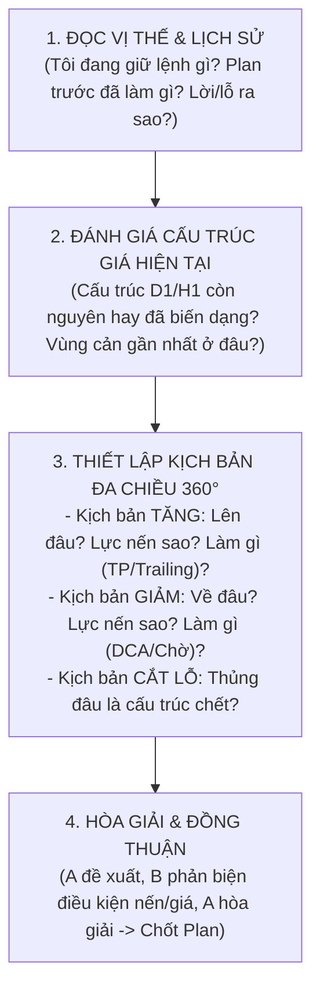

# 📋 TỔNG HỢP NÂNG CẤP: VÒNG ĐỜI PLAN (EXECUTED), TIMELINE MEMORY & KHUNG TƯ DUY ỨNG BIẾN CỦA AGENT
> **Ngày phát hành:** 15/09/2026  
> **Phiên bản:** Kiến trúc A2A v2.2 — *Plan Execution Lifecycle, Macro Timeline Memory & Autonomous Trader Framework*  
> **Dành cho:** Toàn bộ đội ngũ Phát triển (AI Prompt Engineer, Backend Dev, Database Admin, QA/Tester)

---

## 🎯 1. Bối Cảnh & Vấn Đề Cốt Tử Được Giải Quyết

Trong hệ thống giao dịch tự động hóa bằng AI, hai sai lầm lớn nhất thường gặp là:
1. **Hoặc là quá máy móc (Hardcoded rule-based):** Cố gắng code mọi trường hợp thị trường (hàng ngàn case tăng/giảm/dca/tp), dẫn đến code phình to, dễ gãy khi gặp tình huống lạ.
2. **Hoặc là quá hay quên (Amnesia LLM):** Sau khi vào lệnh xong thì không nhớ *vì sao mình vào*, *trước đó đã cam kết làm gì*, dẫn đến hành vi hoảng loạn hoặc đóng lệnh bừa bãi.

Bản nâng cấp **v2.2** này giải quyết dứt điểm bằng 3 cơ chế:
- **Chu trình Đóng Plan cũ $\rightarrow$ Khởi tạo Plan mới:** Khi Plan Chốt đã thực hiện xong (ví dụ khớp lệnh MUA thành công), Plan đó được đánh dấu là `EXECUTED` (Đã thực hiện), clear active plan và chu kỳ tiếp theo Agent **tự động phân tích để lập Plan mới cho giai đoạn tiếp theo**.
- **Chuỗi Ký Ức Xuyên Suốt (Plan History Timeline):** Toàn bộ các Plan đã `EXECUTED` trong Chu kỳ tổng (Macro Cycle) được gửi kèm làm bộ nhớ (Memory), giúp các Agent hiểu rõ: *Chúng ta đã làm gì từ đầu chiến dịch đến giờ, vị thế hiện tại hình thành từ đâu*.
- **Khung Tư Duy Tự Chủ Ứng Biến (Autonomous Trader Thinking Framework):** Không hardcode case cụ thể. Thay vào đó, trang bị cho Agent cách tư duy lập kế hoạch như một Trader chuyên nghiệp: Đứng trước vị thế hiện tại, chủ động vạch ra kịch bản 360 độ (Tăng làm gì, Giảm làm gì, Sideway làm gì, Vi phạm thì cắt ở đâu).

---

## 🔄 2. Vòng Đời Trạng Thái Của Plan (Plan Lifecycle)

Trong Database và Runtime, một Plan trải qua 4 trạng thái rõ ràng:

```
[PLAN TẠM (PROVISIONAL)] 
         │  (A soạn thảo / B phản biện qua các vòng hòa giải)
         ▼  (Khi 100% Agent đồng thuận)
[PLAN CHỐT (COMMITTED / ACTIVE)]
         │  (Chờ nến & giá chạm đúng kịch bản Price Action)
         ├──────────────────────────────────────────────┐
         ▼ (Khớp điều kiện & Đặt lệnh thành công)       ▼ (Thị trường đi quá xa / Cắt tỉa)
[ĐÃ THỰC HIỆN (EXECUTED)]                      [HỦY / CẮT TỈA (CANCELLED/PRUNED)]
         │
         ▼
[GHI VÀO TIMELINE MEMORY]
         │
         ▼
[CLEAR ACTIVE PLAN & KHỞI TẠO VÒNG LẬP PLAN TIẾP THEO]
```

### Chi tiết các trạng thái:
1. **`PROVISIONAL` (Plan Tạm):** Bản thảo đang tranh luận giữa các Agent. Không được kích hoạt lệnh.
2. **`ACTIVE` (Plan Chốt Đang Treo):** Đã được 100% Agent ký duyệt, lưu vào DB với `is_active = TRUE`. Ở chu kỳ sau, chỉ theo dõi khớp trigger, **cấm phân tích lại biểu đồ**.
3. **`EXECUTED` (Đã Thực Hiện Thành Công):**
   - Ví dụ: Kịch bản `DOWNSIDE` của Plan #1 yêu cầu mua khi chạm 2298 kèm nến rút râu. Khi lệnh MUA 0.1 lot đã khớp trên MT5:
   - Hệ thống set Plan #1: `plan_status = 'EXECUTED'`, `executed_at = now()`, `is_active = FALSE`.
   - **BƯỚC TIẾP THEO:** Clear active plan. Chu kỳ tiếp theo hệ thống yêu cầu Agent A & B **phân tích lại từ đầu cho vị thế mới**, nhưng **bắt buộc nạp Plan #1 (EXECUTED) vào Memory** để biết mình vừa làm gì!
4. **`CANCELLED` / `PRUNED` (Hủy / Cắt tỉa):** Bị thay thế hoặc loại bỏ do thị trường đi lệch kịch bản.

---

## 🧠 3. Chuỗi Ký Ức Xuyên Suốt (Plan History Timeline trong Macro Cycle)

Khi tài khoản đang gánh vị thế trong một **Macro Cycle**, mỗi chu kỳ phân tích mới sẽ được nạp một payload gồm:
1. **Vị thế hiện tại:** Số lệnh, tổng lot, PnL âm/dương, giá trung bình hòa vốn.
2. **Plan History Timeline (Lịch sử các Plan đã chốt & thực hiện):**

```json
{
  "macro_cycle_id": "MC_20260915_XAUUSD_001",
  "current_basket": {
    "orders": 1,
    "total_lot": 0.10,
    "basket_dir": "BUY",
    "avg_price": 2305.50,
    "floating_pnl": -35.0
  },
  "plan_history_timeline": [
    {
      "plan_id": "PLAN_001",
      "micro_cycle_id": 1,
      "status": "EXECUTED",
      "action_taken": "ENTRY BUY 0.10 lot @ 2305.50",
      "rationale": "D1 UPTREND, H1 ép giá chạm hỗ trợ H4 hãm đà nến rút chân pinbar.",
      "executed_at": "2026-09-15T02:00:00Z"
    }
  ],
  "request_to_agents": "Lệnh số 1 đã vào xong. Hãy phân tích bối cảnh hiện tại và lập PLAN CHỐT TIẾP THEO để quản lý vị thế này (DCA ở đâu, TP ở đâu, Invalidation ở đâu)."
}
```

Nhờ có Timeline này, Agent A và B sẽ thảo luận cực kỳ logic:
- *"Chúng ta vừa khớp lệnh Buy 0.1 lot ở 2305.50 theo Plan #1."*
- *"Hiện tại giá đang điều chỉnh nhẹ về 2302. Vậy kế hoạch tiếp theo là gì?"*
- *"Nếu giá giảm tiếp về vùng 2295 (hỗ trợ cứng tiếp theo) và có nến xác nhận hãm lực $\rightarrow$ Kịch bản DCA thêm 0.15 lot."*
- *"Nếu giá bật tăng lên 2315 $\rightarrow$ Kịch bản Chốt bớt 50% hoặc dời SL về Entry hòa vốn."*

---

## 🦅 4. Khung Tư Duy Ứng Biến Tự Chủ (Autonomous Trader Framework) Cho Agent

Để Agent không bị cứng nhắc và có thể **tự động ứng biến thông minh với mọi biến động thị trường như một con người**, tài liệu đặc tả quy định khung tư duy 4 câu hỏi (4-Step Mental Model) mà Agent A & B bắt buộc phải tuân theo khi lập Plan:



### Chi tiết 4 Bước Tư Duy Của Agent:
1. **Bước 1 — Nhìn nhận Thực tại (Self-Awareness):** 
   - Đọc `current_basket` và `plan_history_timeline`.
   - Xác định rõ: Mình đang ở pha nào của chiến dịch? (Mới vào lệnh dò đường / Đang gồng lỗ điều chỉnh / Đang có lãi cần bảo toàn).
2. **Bước 2 — Định vị Bản đồ Giá (Market Mapping):**
   - Xác định 2 vùng cản then chốt: **Kháng cự bên trên** và **Hỗ trợ bên dưới**.
   - Đánh giá lực nến hiện tại: Đang đi bình thường hay đang phóng nhanh/xả gấp?
3. **Bước 3 — Lên Kịch bản Phản ứng Chi tiết (Scenario Formulation):**
   - *Nếu giá đi thuận hướng:* Lên tới đâu thì tỉa bớt lệnh? Dời SL về đâu để bảo toàn vốn?
   - *Nếu giá đi ngược hướng:* Được phép chịu đựng đến đâu? Về vùng nào mới được phép DCA? Khối lượng DCA dự kiến là bao nhiêu lot? Điều kiện nến gì mới cho phép nhồi?
   - *Nếu thị trường sideway:* Giữ nguyên vị thế, không táy máy vào thêm lệnh bừa bãi.
   - *Nếu thị trường phá vỡ cấu trúc:* Điểm nào là điểm "chấp nhận sai" để đóng sạch toàn bộ rổ lệnh?
4. **Bước 4 — Cam kết & Ký duyệt:** 
   - Hai Agent thống nhất và ký duyệt thành **Plan Chốt mới (`ACTIVE`)**.
   - Chuyển sang chế độ theo dõi thực thi cho đến khi khớp tiếp!

---

## 🛠️ 5. Hướng Dẫn Kỹ Thuật Cho Dev

### Cho Database Admin:
- Trong bảng `contingency_plans`:
  - Thêm trường `plan_status VARCHAR(16) NOT NULL DEFAULT 'ACTIVE'`: Các giá trị gồm `ACTIVE`, `EXECUTED`, `CANCELLED`.
  - Thêm trường `executed_at TIMESTAMP NULL`.
  - Thêm trường `execution_notes TEXT NULL` (Ghi nhận lệnh thực thi: ticket nào, lot bao nhiêu, giá nào).

### Cho Backend / Orchestrator Dev:
- Khi `Executor` báo khớp lệnh thành công từ MT5:
  1. Cập nhật Plan hiện tại thành `plan_status = 'EXECUTED'`, `is_active = FALSE`.
  2. Ghi một dòng tóm tắt vào `plan_history_timeline` của `macro_cycle` đó.
  3. Ở chu kỳ tiếp theo: Kích hoạt nhịp phân tích lập Plan mới, gửi kèm `plan_history_timeline` cho LLM.

### Cho AI / Prompt Engineer:
- Cập nhật System Prompt Agent A & B theo **Autonomous Trader Framework**:
  - Hướng dẫn Agent luôn đọc `plan_history_timeline` trước khi phát biểu.
  - Khuyến khích Agent chủ động tính toán mốc giá, tỷ lệ chốt lời, bước giá DCA dựa trên ATR và cấu trúc nến, không phụ thuộc vào các hằng số cứng.
