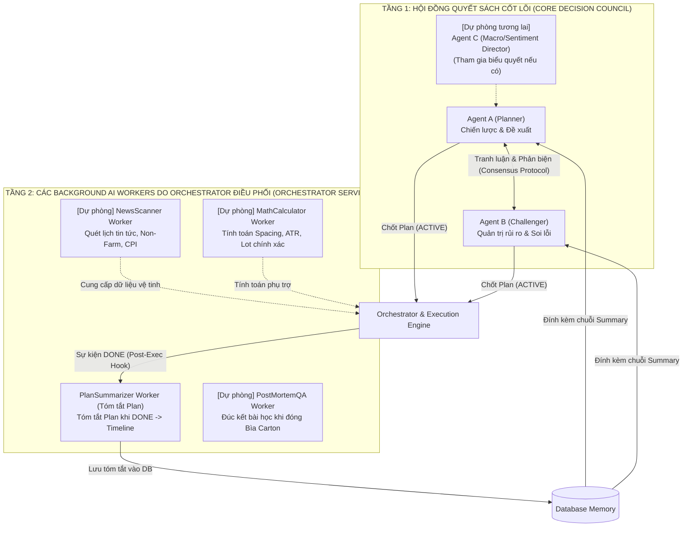

# 📋 TỔNG HỢP NÂNG CẤP: VÒNG ĐỜI PLAN (ACTIVE/DONE), BÌA CARTON MACRO CYCLE & PLANSUMMARIZER WORKER
> **Ngày phát hành:** 18/09/2026  
> **Phiên bản:** Kiến trúc A2A v2.3 — *Multi-session Plan Persistence, PlanSummarizer Worker & Tiered Extensible Architecture*  
> **Dành cho:** Toàn bộ đội ngũ Phát triển (AI Prompt Engineer, Backend Dev, Database Admin, QA/Tester)

---

## 🎯 1. Bối Cảnh & Vấn Đề Cốt Tử Được Giải Quyết

Trong hệ thống giao dịch tự động hóa bằng AI, hai sai lầm lớn nhất thường gặp là:
1. **Lỗi "Mất trí nhớ tạm thời" giữa các phiên (Amnesia Re-entry):**
   - *Hiện tượng thực tế:* Agent A và B chốt kịch bản SELL và khớp lệnh SELL thành công. Qua chu kỳ nến kế tiếp, hệ thống nạp lại biểu đồ mới toanh mà không mang theo kế hoạch trước đó $\rightarrow$ Hai Agent không nắm được mình vừa làm gì $\rightarrow$ lại ngứa tay phân tích lại từ đầu và **tiếp tục nhồi thêm lệnh SELL bừa bãi** làm vỡ cấu trúc rủi ro!
2. **Quá máy móc hoặc quá loãng vai trò:**
   - Hoặc bắt Agent B kiêm nhiệm quá nhiều việc (vừa phản biện khắt khe, vừa ghi chép tóm tắt) làm loãng tính sắc bén của vai trò Challenger.
   - Hoặc thiếu cơ chế duy trì một kế hoạch xuyên suốt nhiều phiên nến (Multi-session Persistence).

Bản nâng cấp **v2.3** giải quyết dứt điểm các vấn đề trên thông qua **4 trụ cột kiến trúc**:
- **Mô hình "Bìa Carton & Các Tờ Giấy Plan Chốt":** Quản lý trọn vẹn chiến dịch từ lúc chưa có lệnh (FLAT) cho đến khi đóng sạch lệnh.
- **Hai trạng thái sống của Plan Chốt (`ACTIVE` vs `DONE`):** Duy trì hiệu lực xuyên suốt nhiều chu kỳ nến mà không phân tích lại thị trường.
- **PlanSummarizer Worker (Background AI Worker của Orchestrator):** Chuyên trách tóm tắt ngắn gọn khách quan khi một Plan chuyển sang `DONE`. Đây là một Worker chạy ngầm độc lập do Orchestrator điều động tại luồng sự kiện hậu kỳ (Post-Execution Lifecycle Hook), hoàn toàn **không phải do Agent A hay B gọi**, giúp giải phóng hoàn toàn và không làm loãng vai trò của A & B.
- **Kiến trúc Phân tầng Mở rộng Tương lai (Tiered Extensible Architecture):** Thiết kế sẵn sàng để sau này bổ sung thêm các Background AI Workers việc vặt (quét tin tức, tính lot/spread...) hoặc nâng cấp thêm Agent chính (Agent C) mà hoàn toàn **không gây xung đột (conflict)** với hệ thống hiện tại.


---

## 📦 2. Mô Hình "Bìa Carton & Các Tờ Giấy Plan Chốt" (Macro Cycle Architecture)

Một chiến dịch giao dịch được ví như **một chiếc bìa carton (Macro Cycle)**, bên trong kẹp **các tờ giấy (Plan Chốt)** nối tiếp nhau:

```
[BẮT ĐẦU BÌA CARTON: Tài khoản FLAT (0 lệnh)]
   │
   ├─► TỜ GIẤY 1: Plan Chốt 1 (ACTIVE) ──(Chờ đợi/Thực thi)──► [DONE] ──► PlanSummarizer: [SUMMARY 1]
   │                                                                            │
   ├─► TỜ GIẤY 2: Bàn Plan 2 (kèm SUMMARY 1) ──► Plan 2 (ACTIVE) ──► [DONE] ──► PlanSummarizer: [SUMMARY 2]
   │                                                                            │
   ├─► TỜ GIẤY 3: Bàn Plan 3 (kèm SUMMARY 1 + 2) ──► Plan 3 (ACTIVE) ──► [DONE] ──► PlanSummarizer: [SUMMARY 3]
   │   ...
   ▼
[ĐÓNG BÌA CARTON: Toàn bộ rổ lệnh được CLEAR hoàn toàn (Chốt lời hết / Cắt lỗ hết)]
```

### Vòng lặp chuẩn mực:
$$\text{Bàn luận} \rightarrow \text{Chốt Plan 1 (ACTIVE)} \rightarrow \text{Thực thi} \rightarrow \text{Plan 1 DONE} \rightarrow \text{PlanSummarizer tóm tắt Plan 1} \rightarrow \text{Mang Summary 1 bàn Plan 2} \dots$$


---

## 🔄 3. Chi Tiết Hai Trạng Thái Sống Của Plan Chốt: ACTIVE vs DONE

Plan chốt là một **Contingency Plan đa kịch bản 360 độ** (chứa nhiều biến thể: Entry, DCA, Dời SL hòa vốn, Trailing SL, Chốt bớt khối lượng, Chờ đợi nến xác nhận, Cắt lỗ khẩn cấp).

### 🟡 Trạng thái 1: `plan_status = 'ACTIVE'` (Kế hoạch đang chạy / Đang canh thị trường)
- **Bản chất:** Plan đã được A & B ký duyệt 100%, giao nhiệm vụ canh thị trường xuất hiện điều kiện để hành động.
- **Tính chất Xuyên suốt Nhiều Chu kỳ (Multi-session Persistence):**
  - Thị trường có thể đi ngang, mất 1 chu kỳ, 5 chu kỳ hay 20 chu kỳ nến mới chạm đến các mốc kịch bản.
  - Ở **TẤT CẢ** các chu kỳ này: Hệ thống **tự động mang Plan Chốt `ACTIVE` này đi theo**.
  - **KHÓA TUYỆT ĐỐI (Lockdown Rule):** A và B **CẤM phân tích lại thị trường từ đầu**, **CẤM tự ý mở thêm lệnh mới**. Chúng chỉ đóng vai trò giám sát viên (Supervisor): *Nến mới đã chạm vào kịch bản nào chưa? Nếu chưa $\rightarrow$ STANDBY (ngủ tiếp); Nếu chạm $\rightarrow$ kích hoạt đúng hành động đã chốt*.

### 🟢 Trạng thái 2: `plan_status = 'DONE'` (Hoàn thành sứ mệnh)
- **Khi nào chuyển sang `DONE`?**
  - Khi **một trong các kịch bản hành động then chốt của Plan đã diễn ra và được thực thi xong trên thực tế**:
    + *Biến thể Vào lệnh:* Lệnh SELL 1 đã khớp thành công trên sàn $\rightarrow$ `DONE`.
    + *Biến thể Chốt lời linh hoạt / Thoát sớm:* Giá chạm TP mục tiêu (ví dụ 100 pip) HOẶC mới chạy được một đoạn (ví dụ 50 pip) nhưng AI nhận định cạn kiệt đà nên cắt sạch toàn bộ lệnh (`CLOSE_ALL`) để bảo toàn lãi $\rightarrow$ `DONE` (kết thúc luôn Bìa Carton).
    + *Biến thể Chốt lời từng phần:* Giá chạm cản ngắn hạn, đã chốt bớt 50% khối lượng $\rightarrow$ `DONE`.
    + *Biến thể Nhồi lệnh DCA:* Giá hồi về vùng hỗ trợ kèm nến hãm đà, đã khớp lệnh DCA 2 $\rightarrow$ `DONE`.
    + *Biến thể Cắt lỗ:* Giá vi phạm mốc Invalidation, đã đóng sạch lệnh bảo toàn vốn $\rightarrow$ `DONE` (kết thúc luôn Bìa Carton).
- **Hành động ngay khi `DONE`:**
  - Cập nhật DB: `plan_status = 'DONE'`, `is_active = FALSE`.
  - Đánh thức **PlanSummarizer** để ghi nhận biên niên sử.

---

## ✍️ 4. PlanSummarizer Worker (Post-Execution AI Worker Của Orchestrator)

> **LƯU Ý VỀ MẶT KIẾN TRÚC:** `PlanSummarizer` **KHÔNG PHẢI là Subagent** của Agent A hay B. Nó xuất hiện ở một luồng hoàn toàn độc lập (Post-Execution Lifecycle Hook do Orchestrator kích hoạt sau khi sàn khớp lệnh). Agent A và B không hề gọi, không quản lý và không bị phân tâm bởi tiến trình này.

### Đặc điểm của PlanSummarizer Worker:
1. **One-shot & Siêu nhẹ:** Chỉ được Orchestrator kích hoạt khi có sự kiện `plan_status = 'DONE'`. Sau khi viết tóm tắt xong thì tắt ngay, không tốn tài nguyên.
2. **Chi phí token gần như bằng 0:** PlanSummarizer chỉ làm nhiệm vụ trích xuất thông tin nên được chỉ định dùng các **mô hình AI siêu nhanh, siêu rẻ** (như `Gemini 1.5 Flash`, `GPT-4o-mini`, `Claude 3.5 Haiku`).
3. **Trung lập & Khách quan tuyệt đối (Ground Truth):** Không thiên vị, không tranh luận, ghi chép chính xác những gì vừa diễn ra thành **2 - 3 dòng gạch đầu dòng**.

### Ví dụ kết quả tóm tắt của PlanSummarizer Worker:
```text
[SUMMARY PLAN #1 - DONE]
- Hành động: Đã khớp lệnh SELL 0.10 lot tại 2315.00 theo kịch bản D1 Downtrend chạm cản H1 rút râu.
- Hiện trạng vị thế: Đang giữ 1 lệnh SELL (0.10 lot), giá vốn 2315.00, SL đặt tại 2322.00.
- Trạng thái rủi ro: Rủi ro rổ lệnh đang ở mức cơ bản (Risk = 1.2% Balance).
```

Chuỗi này được lưu vào cột `summary_text` của bảng `contingency_plans` và được nạp vào danh sách `plan_history_summaries` để phục vụ vòng lập Plan tiếp theo.

---

## 🏛️ 5. Kiến Trúc Phân Tầng Mở Rộng Tương Lai (Tiered Extensible Architecture)

Để đảm bảo sau này bổ sung thêm các Background Workers việc vặt hoặc nâng cấp thêm Agent chính mà **hoàn toàn không gây xung đột (conflict)** với hệ thống hiện tại, tài liệu định hình rõ 2 tầng:



### Quy tắc bất biến chống conflict:
1. **Quyền biểu quyết lệnh (Consensus Gate):** Chỉ thuộc về các Agent ở **Tầng 1** (hiện tại là A & B). Các AI Workers ở **Tầng 2** tuyệt đối không can thiệp vào biểu quyết, không có quyền phủ quyết lệnh.
2. **Workers là các dịch vụ nền độc lập (Plug & Play):** Bổ sung hoặc gỡ bỏ một Worker việc vặt (như NewsScanner, MathCalculator) do Orchestrator gọi hoàn toàn không làm gián đoạn luồng giao dịch và consensus của A và B.
3. **Nếu tương lai thêm Agent C vào Tầng 1:** Chỉ cần bổ sung Agent C vào vòng biểu quyết đồng thuận (Consensus Quorum: A + B + C = 100% APPROVE), toàn bộ cơ chế Plan Lifecycle `ACTIVE`/`DONE` và Timeline Memory bên dưới vẫn giữ nguyên vẹn.


---

## 🛠️ 6. Hướng Dẫn Kỹ Thuật Dành Cho Dev

### Cho Database Admin:
Cập nhật bảng `contingency_plans` để hỗ trợ đầy đủ 2 trạng thái và lưu trữ tóm tắt của PlanSummarizer:
```sql
ALTER TABLE contingency_plans 
ADD COLUMN plan_status VARCHAR(16) NOT NULL DEFAULT 'ACTIVE'; 
-- Các giá trị chuẩn: 'ACTIVE' (đang chạy/chờ), 'DONE' (đã thực thi xong), 'CANCELLED' (hủy/thay thế)

ALTER TABLE contingency_plans 
ADD COLUMN summary_text TEXT NULL;
-- Lưu chuỗi tóm tắt 2-3 dòng do PlanSummarizer sinh ra ngay khi plan chuyển sang DONE
```

### Cho Backend / Orchestrator Dev:
1. **Khi Plan đang `ACTIVE`:** Mỗi nhịp wake C0 (H1 close) hoặc C3: Chỉ nạp Plan `ACTIVE` + Delta giá nến mới. CẤM gọi LLM phân tích lại toàn bộ thị trường.
2. **Khi phát hiện một nhánh hành động đã hoàn tất (Vào lệnh / Dời SL / Chốt bớt):**
   - Đánh dấu Plan cũ: `plan_status = 'DONE'`, `is_active = FALSE`.
   - Kích hoạt One-shot **PlanSummarizer**: truyền vào Plan vừa xong + thông tin thực thi thực tế.
   - Nhận `summary_text` từ PlanSummarizer và lưu vào DB.
3. **Khi bắt đầu chu kỳ bàn Plan tiếp theo:**
   - Trích xuất toàn bộ `summary_text` của các Plan đã `DONE` trong Macro Cycle hiện tại thành chuỗi `plan_history_summaries`.
   - Đính kèm vào System Prompt đầu vào của Agent A và Agent B.

### Cho Prompt Engineer:
- **System Prompt PlanSummarizer:** *"Bạn là Thư ký Tóm tắt Kế hoạch (PlanSummarizer) trung lập. Nhiệm vụ duy nhất của bạn là đúc kết Kế hoạch vừa hoàn thành thành 2-3 gạch đầu dòng súc tích: Hành động đã làm, Hiện trạng vị thế và Mức độ rủi ro hiện tại. Tuyệt đối không đưa cảm xúc hay phân tích dài dòng."*
- **Prompt Agent A & B ở các phiên sau:** *"Đọc kỹ khối [PLAN HISTORY SUMMARIES] để nắm rõ hiện trạng các bước đã đi trước đó. Cấm lặp lại các hành động đã thực hiện hoặc vào lệnh vi phạm khoảng cách an toàn với các lệnh trước."*


