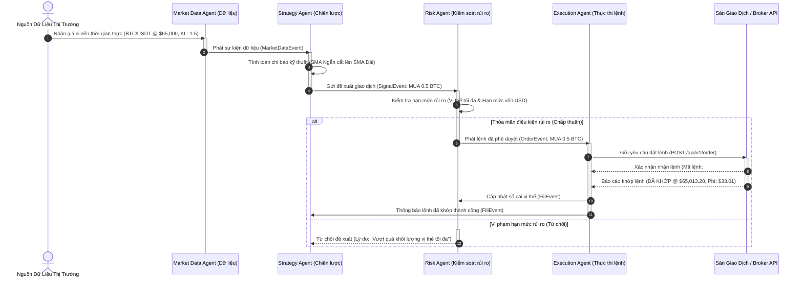
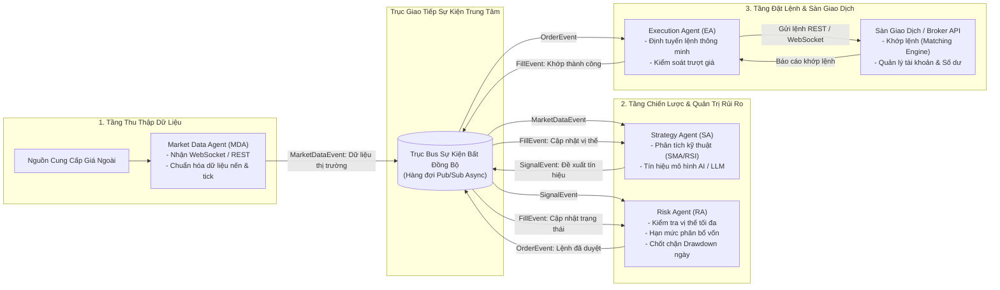
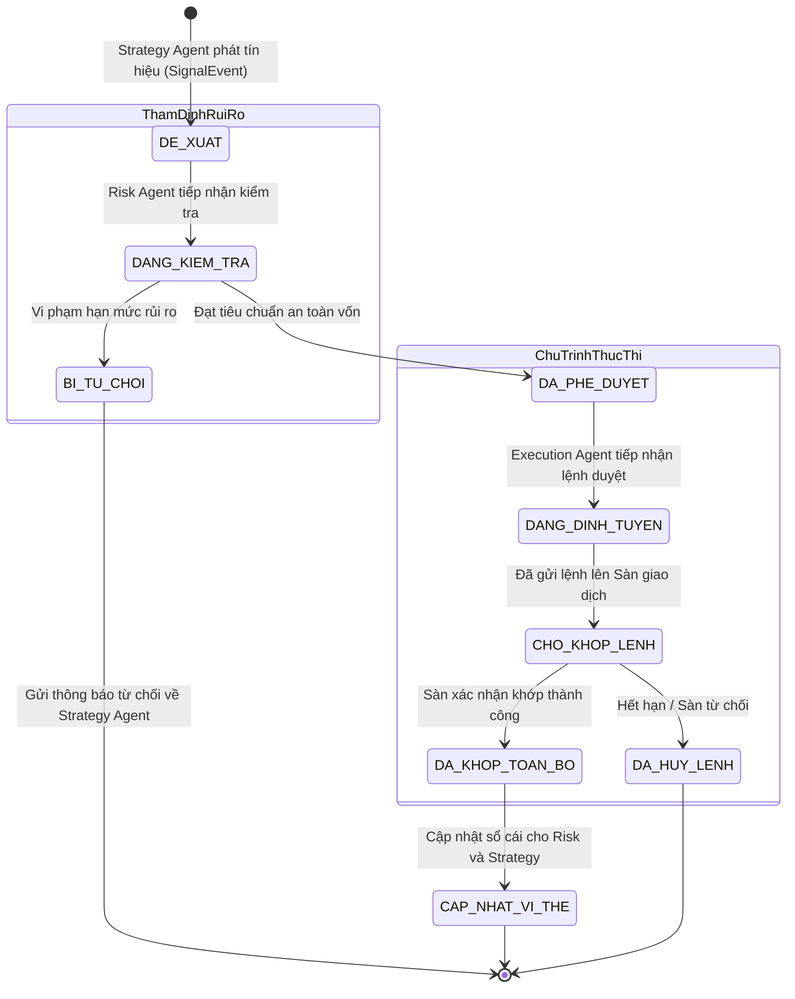
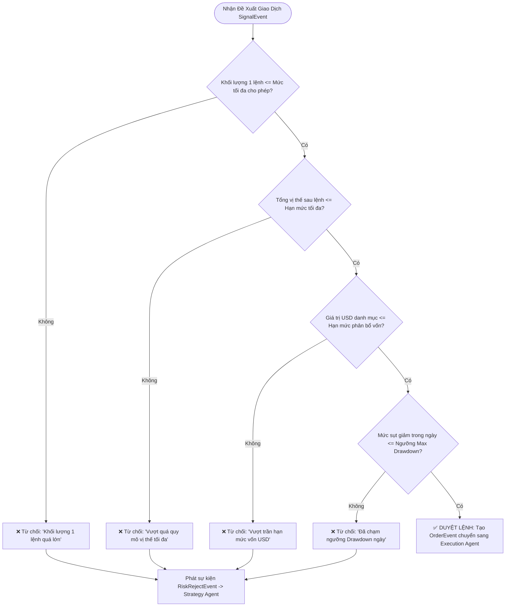

# 📊 Hệ Thống Giao Dịch A2A - Bộ Đặc Tả Nghiệp Vụ & Biểu Đồ (BA)

Tài liệu đặc tả nghiệp vụ và kiến trúc luồng dành cho **Business Analyst (BA)** và đội ngũ phát triển (Dev / QA) trong dự án **Giao dịch Tự động hóa Agent-to-Agent (A2A)**.

> 📢 **CÁC BẢN NÂNG CẤP MỚI NHẤT DÀNH CHO DEV:** 
> - 📄 **[NANG_CAP_PLAN_LIFECYCLE_VA_TIMELINE_MEMORY.md](NANG_CAP_PLAN_LIFECYCLE_VA_TIMELINE_MEMORY.md)** *(Mới nhất - v2.3)*: Vòng đời Plan ACTIVE vs DONE, Mô hình Bìa Carton (Macro Cycle), PlanSummarizer và Kiến trúc Phân tầng Mở rộng.
> - 📄 **[NANG_CAP_PLAN_TAM_CHOT_PRICE_ACTION_PRUNING.md](NANG_CAP_PLAN_TAM_CHOT_PRICE_ACTION_PRUNING.md)** *(v2.1)*: Plan Tạm vs Plan Chốt, Lực nến Price Action và Thuật toán Cắt tỉa kịch bản (Plan Pruning).
> - 📄 **[UPGRADE_CONTINGENCY_PLAN_SPEC.md](doc/UPGRADE_CONTINGENCY_PLAN_SPEC.md)**: Tài liệu đặc tả kỹ thuật chi tiết nhất (JSON Schemas, SQL DDL, Sequence Diagram).
> - 📄 **[TONG_HOP_THAY_DOI_NANG_CAP.md](TONG_HOP_THAY_DOI_NANG_CAP.md)** *(v2.0)*: Kiến trúc chu kỳ hai tầng (Macro/Micro Cycle).

---

## � Flow Studio — Sơ Đồ Quy Trình Kiểu n8n ([`flow_studio/index.html`](flow_studio/index.html))

**Công cụ xem & chỉnh sửa quy trình vận hành v2.3 theo dạng node-based (giống n8n):**
- ✅ Tab 0 **Bản đồ TỔNG HỢP**: toàn bộ ~60 bước của 7 luồng trên cùng 1 canvas, chia theo 7 vùng chức năng + các mũi tên nét đứt liên kết chéo giữa hệ con. Tab này **tự sinh** từ các tab chi tiết qua [`flow_studio/overview-builder.js`](flow_studio/overview-builder.js) — sửa tab chi tiết là bản đồ tổng tự cập nhật.
- ✅ 7 luồng nghiệp vụ chi tiết: Chu kỳ Wake & Quyết định, Vòng đời Plan, Bộ nhớ Kinh nghiệm, State Machine, FREEZE/Reconcile, Boss Channel, Đa tiến trình.
- ✅ **Hover node** → tooltip tóm tắt; **Click node** → panel chi tiết kèm link tới file doc liên quan + tham chiếu DEC/ADR.
- ✅ **Chế độ Sửa:** kéo-thả node, sửa nội dung/nhãn edge, thêm-xóa node/edge → **Xuất `flows-data.js`** ghi đè file gốc để lưu vĩnh viễn (dữ liệu tách riêng trong [`flow_studio/flows-data.js`](flow_studio/flows-data.js) — dễ sửa tay khi nâng cấp doc).
- ✅ Pan/zoom canvas, legend phân loại node (Engine/Agent/DB/Executor/...), chạy offline (không cần CDN). Toàn bộ tool gọn trong folder [`flow_studio/`](flow_studio/).

---

## �🖥️ Công Cụ Trực Quan Hóa Tương Tác ([`index.html`](index.html))

Dự án đã tích hợp sẵn công cụ **A2A Diagram Studio** (file [`index.html`](index.html)):
- ✅ **Xem sẵn 4 loại biểu đồ nghiệp vụ 100% Tiếng Việt** (Tuần tự, Kiến trúc, Vòng đời lệnh, Cây quyết định rủi ro).
- ✅ **Trực tiếp chỉnh sửa (Live Edit)** mã Mermaid và tự động cập nhật biểu đồ.
- ✅ **Phóng to / Thu nhỏ / Kéo thả (Zoom & Pan)** mượt mà trên canvas.
- ✅ **Xuất ảnh chất lượng cao (Export PNG / SVG)** hoặc sao chép mã Mermaid để chèn vào tài liệu BRD / SRS, Jira hoặc Confluence.

> 💡 **Cách sử dụng:** Nhấp đúp chuột vào file [`index.html`](index.html) để mở trực tiếp trên trình duyệt web (Chrome, Edge, Firefox, Cốc Cốc).

---

> ⚠️ **GHI CHÚ PHIÊN BẢN (v2.3):** Các mục 1–5 bên dưới là **biểu đồ BA tham khảo từ kiến trúc v0.x** (mô hình MDA → SA → RA → EA, ví dụ SMA crossover / BTC-USDT). Chúng **không phải** kiến trúc hiện hành.
>
> **Kiến trúc chuẩn hiện nay (v2.x):** Engine (mắt, deterministic) → **Agent A (Planner)** → **Agent B (Challenger)** → Consensus → `HardValidator` → ExecutionQueue → **Executor** (duy nhất chạm MT5). Kế hoạch là `UnifiedContingencyPlan` 4 nhánh (UPSIDE/DOWNSIDE/INVALIDATION/STANDBY) với vòng đời PROVISIONAL→COMMITTED→ACTIVE→DONE/SUPERSEDED.
>
> 📌 **Nguồn sự thật:** [`doc/UPGRADE_CONTINGENCY_PLAN_SPEC.md`](doc/UPGRADE_CONTINGENCY_PLAN_SPEC.md) + [`doc/ERRATA.md`](doc/ERRATA.md) (DEC-01..18) + [`doc/doc_agents/`](doc/doc_agents/) + [`doc/doc_phuong_phap/`](doc/doc_phuong_phap/) + [`doc/doc_flow_code/`](doc/doc_flow_code/).

---

## 1. Biểu Đồ Tuần Tự: Luồng Giao Tiếp Nghiệp Vụ A2A (Sequence Diagram) — *Legacy v0.x*

---

## 2. Kiến Trúc Thành Phần & Trục Hàng Đợi (Architecture Diagram)

---

## 3. Vòng Đời Trạng Thái Lệnh (Order State Machine)

---

## 4. Cây Quyết Định Kiểm Soát Rủi Ro (Risk Decision Tree)

---

## 5. Bảng Ma Trận Nghiệp Vụ Các Thành Phần (BA Matrix)

| STT | Thành phần (Agent) | Vai trò nghiệp vụ | Dữ liệu đầu vào (Input) | Dữ liệu đầu ra (Output) |
| :--- | :--- | :--- | :--- | :--- |
| **1** | **Market Data Agent (MDA)** | Thu thập, làm sạch và phát tán dữ liệu giá/nến thời gian thực. | WebSocket / REST tick từ sàn | `MarketDataEvent` (Giá, Khối lượng, Đỉnh, Đáy) |
| **2** | **Strategy Agent (SA)** | Phân tích kỹ thuật (SMA, RSI) hoặc mô hình AI để tạo tín hiệu mua/bán. | `MarketDataEvent`, `FillEvent` | `SignalEvent` (Hành động: MUA/BÁN, Khối lượng) |
| **3** | **Risk Agent (RA)** | Cổng gác an toàn vốn: Thẩm định khối lượng lệnh, tổng vị thế và drawdown. | `SignalEvent`, `FillEvent` | `OrderEvent` (nếu duyệt) hoặc `RiskRejectEvent` (nếu từ chối) |
| **4** | **Execution Agent (EA)** | Định tuyến lệnh thông minh, gửi lệnh sàn và theo dõi khớp lệnh. | `OrderEvent`, Phản hồi từ sàn | Lệnh gửi sàn & `FillEvent` (Báo cáo khớp lệnh) |
| **5** | **Sàn Giao Dịch / Broker API** | Sàn thực hiện khớp lệnh và quản lý số dư/tài sản. | Yêu cầu đặt lệnh | Kết quả khớp lệnh, Phí giao dịch |
