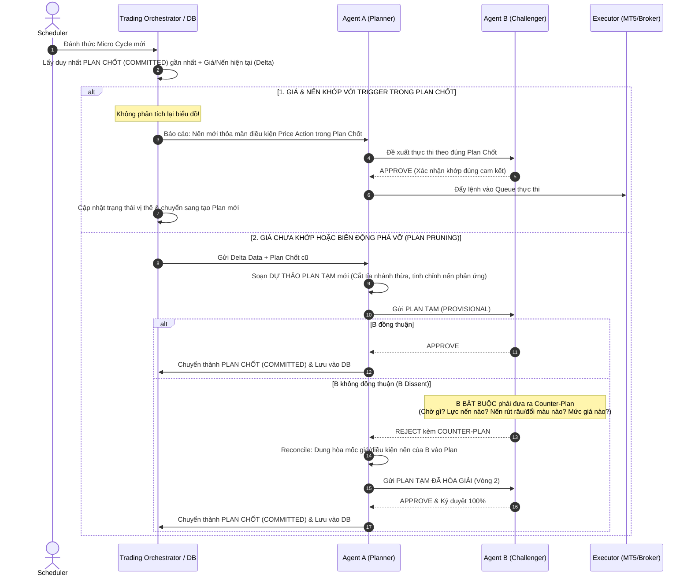

# 🚀 TÀI LIỆU ĐẶC TẢ KỸ THUẬT NÂNG CẤP HỆ THỐNG GIAO DỊCH A2A
## Phiên Bản Kiến Trúc: Macro/Micro Cycle & Unified Contingency Planning

> **Dành cho:** Development Team (Backend / AI Agent / Database Engineer)  
> **Mục tiêu:** Chuyển đổi mô hình giao dịch A2A từ **Stateless (Mỗi nến phân tích lại từ đầu)** sang **Stateful & Contingency Planning (Lập kế hoạch đa kịch bản 2 đầu & Thực thi theo kế hoạch)**, giúp tiết kiệm **70% - 80% Token LLM** và nâng cao tính kỷ luật, nhất quán trong quyết định giao dịch.

---

## 1. Bối Cảnh & Vấn Đề Cần Giải Quyết

### 1.1. Hiện Trạng (Kiến trúc cũ)
1. **Lãng phí Token & Độ trễ cao:** Mỗi chu kỳ thức dậy (sau mỗi cây nến H1 hoặc M15), hệ thống lại gửi toàn bộ snapshot gồm 30-50 nến lịch sử cho cả Agent A và Agent B. Hai LLM phải "đọc hiểu lại biểu đồ từ số 0" dù cấu trúc xu hướng thị trường không đổi nhiều.
2. **Hiện tượng "Mất trí nhớ" & Đổi ý thất thường (Flip-flop / Hallucination):** Vì không có kế hoạch hành động ràng buộc từ chu kỳ trước, chỉ cần 1 râu nến giật nhỏ cũng có thể khiến LLM thay đổi phán đoán 180 độ (nến trước vừa khuyên Buy, nến sau lại khuyên Sell).
3. **Agent B từ chối thụ động (Passive Dissent):** Agent B khi không đồng ý với Agent A chỉ đơn giản trả về `REJECT` hoặc `CHALLENGE` chung chung mà không đưa ra cam kết: *Nếu không vào lệnh bây giờ thì đang chờ điều gì? Ở mức giá nào hoặc điều kiện nến nào thì mới chịu vào?*

### 1.2. Mục Tiêu Thiết Kế Mới
1. **Nguyên tắc "Trade the Plan":** Mọi chu kỳ kết thúc **BẮT BUỘC** phải lưu trữ một **Unified Contingency Plan (Kế hoạch hành động dự phòng thống nhất)** có đầy đủ kịch bản 2 đầu (Giá TĂNG làm gì, Giá GIẢM làm gì, Sideway/Chờ làm gì, Vi phạm thì cắt lỗ ở đâu).
2. **Tối ưu Token bằng Delta Input:** Chu kỳ sau thức dậy **KHÔNG gửi lại 30 nến lịch sử**. Hệ thống chỉ nạp: `Active Plan kỳ trước` + `Delta Nến mới / Giá hiện tại`.
3. **Cơ chế phản biện có điều kiện (Counter-Plan):** Loại bỏ nhu cầu dùng Agent C (Thư ký). Khi Agent B từ chối Agent A, B **bắt buộc** phải đưa ra **Counter-Plan chi tiết**. Hai agent sẽ tự đối thoại để hợp nhất (Reconcile) thành 1 Plan chung.
4. **Phân cấp 2 tầng chu kỳ (Macro vs Micro Cycle):** Định nghĩa rành mạch vòng đời từ khi tài khoản chưa có lệnh (`FLAT`), mở lệnh, quản lý vị thế cho đến khi clear sạch toàn bộ rổ lệnh.

---

## 2. Kiến Trúc Chu Kỳ Hai Tầng (Macro Cycle vs Micro Cycle)

```
========================================================================================
[MACRO CYCLE] (Chu kỳ Tổng / Chiến dịch giao dịch)
Khởi động khi: FLAT (0 lệnh) -> Kết thúc khi: Lệnh clear sạch (FLAT)
========================================================================================
   │
   ├── [Micro Cycle 1]: Phân tích ban đầu (Initial Analysis)
   │     ├─ A & B thống nhất: Chưa có điểm vào đẹp, chờ nến H1 đóng trên 2305.
   │     └─ Sinh ra: UNIFIED PLAN #1 (Scenarios: UPSIDE, DOWNSIDE, STANDBY)
   │
   ├── [Micro Cycle 2]: Trigger Check (Nến mới H1 đóng @ 2306.50)
   │     ├─ Khớp đúng điều kiện UPSIDE của Plan #1!
   │     ├─ Thực thi: ENTRY Lệnh #1 (BUY 0.1 lot).
   │     └─ Sinh ra: UNIFIED PLAN #2 (Scenarios DCA khi giá hồi, TP khi giá bay tiếp).
   │
   ├── [Micro Cycle 3]: Trigger Check (Giá điều chỉnh về 2298.00)
   │     ├─ Khớp điều kiện DOWNSIDE của Plan #2!
   │     ├─ Thực thi: DCA Lệnh #2 (BUY 0.15 lot).
   │     └─ Sinh ra: UNIFIED PLAN #3 (Kế hoạch hòa vốn, quản trị rổ lệnh).
   │
   ├── [Micro Cycle 4]: Re-eval / Market Shift (Tin tức bất ngờ ra)
   │     ├─ A & B họp khẩn: Cập nhật lại mốc Invalidation (Cắt lỗ) và TP.
   │     └─ Cập nhật: UNIFIED PLAN #4.
   │
   └── [Micro Cycle 5]: Trigger Check (Giá đạt 2315.00)
         ├─ Khớp mục tiêu TAKE_PROFIT_ALL của Plan #4.
         ├─ Thực thi: Đóng toàn bộ lệnh (Trạng thái về FLAT).
         └─ ĐÓNG MACRO CYCLE -> Tổng kết PnL, sinh Lesson Learned.
```

### 2.1. Phân biệt Macro Cycle và Micro Cycle

| Tiêu chí | Macro Cycle (Chu kỳ tổng) | Micro Cycle (Chu kỳ chi tiết) |
| :--- | :--- | :--- |
| **Bản chất** | Một chiến dịch giao dịch hoàn chỉnh (Trading Campaign). | Một nhịp đánh giá, phản biện hoặc khớp trigger giữa các nến. |
| **Điều kiện bắt đầu** | Tài khoản ở trạng thái `FLAT` (không còn vị thế mở nào của cặp tiền đó). | Khi Scheduler đánh thức theo chu kỳ nến hoặc theo mức giá hẹn trước. |
| **Điều kiện kết thúc** | Toàn bộ các lệnh thuộc chiến dịch đã đóng hết (về lại `FLAT`). | Sau khi đã thực thi lệnh (nếu trúng trigger) HOẶC sau khi A & B đã chốt xong Unified Plan mới. |
| **Dữ liệu đầu vào LLM** | D1 Context, H1 Setup, Bài học kinh nghiệm từ quá khứ (MemoryPack). | **Active Plan từ Micro Cycle trước** + Giá hiện tại + Nến nảy sinh (Delta). |
| **Đầu ra chính** | Kết quả PnL, Win/Loss rate, Bài học kinh nghiệm (Lesson Learned). | Lệnh thực thi (nếu trúng trigger) + **Unified Contingency Plan cho kỳ kế tiếp**. |

---

## 3. Quy Trình Đồng Thuận A - B & Vòng Đời Plan Tạm vs Plan Chốt

### 3.0. Phân Định Vòng Đời: Plan Tạm (Provisional) vs Plan Chốt (Committed)
- **Plan Tạm (`PROVISIONAL`):**
  - Được tạo ra bởi Agent A khi khởi thảo, hoặc sau khi A và B thống nhất nhưng chuẩn bị đưa cho Agent thứ ba (nếu sau này mở rộng thêm Agent C).
  - Trạng thái: Lưu trong Memory/Cache phiên thương lượng, **tuyệt đối không dùng để kích hoạt lệnh**.
- **Plan Chốt (`COMMITTED`):**
  - Chỉ được xác lập khi **100% Agent liên quan đồng thuận (`APPROVE`)**.
  - Được ghi xuống Database với cờ `is_active = TRUE`.
  - **Ở chu kỳ tiếp theo:** Hệ thống **CHỈ gửi duy nhất Plan Chốt** cho các Agent. Các Agent **bị khóa quyền phân tích lại biểu đồ (No re-analysis)**, chỉ làm nhiệm vụ giám sát (Observer): Kiểm tra xem giá và nến có khớp đúng kịch bản của Plan Chốt hay không.

### 3.1. Cơ Chế Phản Biện & Hòa Giải (Không Cần Agent C)

Thay vì bổ sung thêm Agent C (Thư ký làm tăng độ trễ và chi phí token), hệ thống sử dụng quy trình **Propose -> Challenge with Counter-Plan -> Reconcile**:



### 3.2. Thuật Toán Cắt Tỉa Kịch Bản (Plan Pruning & Dynamic Focusing)
Khi thị trường tăng vọt hoặc xả mạnh một chiều không có dấu hiệu hãm đà:
1. **Prune (Cắt tỉa):** Tự động xóa bỏ hoàn toàn các nhánh kịch bản đối lập đã lỗi thời (ví dụ: thị trường tăng mạnh phá đỉnh thì xóa nhánh chờ mua ở đáy dưới).
2. **Refine & Focus (Tinh chỉnh & Tập trung):** Giữ lại nhánh đang xảy ra nhưng thắt chặt điều kiện:
   - Dời vùng cản lên cao hơn.
   - Bổ sung yêu cầu: *"Chờ nến H1 rút râu trên hoặc xuất hiện 2 nến đỏ liên tiếp xác nhận hãm lực hoàn toàn mới được Bán"*.
3. **Lợi ích:** Kích thước Plan gửi cho LLM ở chu kỳ sau siêu ngắn, loại bỏ nhiễu, tập trung 100% năng lực suy luận.

### 3.3. Chu Trình Plan Đã Thực Hiện (EXECUTED) -> Clear Plan & Timeline Memory
Khi một kịch bản trong Plan Chốt được kích hoạt và lệnh đã được khớp thành công trên sàn (ví dụ lệnh MUA 0.1 lot đã khớp):
1. **Chuyển trạng thái sang `EXECUTED`:**
   - Plan hiện tại được cập nhật: `plan_status = 'EXECUTED'`, `is_active = FALSE`.
   - Ghi chú thực thi: `execution_notes = "Khớp lệnh BUY 0.10 lot @ 2305.50 lúc 08:30"`.
2. **Clear Active Plan & Ghi vào Timeline:**
   - Hệ thống clear active plan để kết thúc chu trình của Plan đó.
   - Lưu tóm tắt Plan đã thực hiện vào `plan_history_timeline` của `Macro Cycle` hiện tại.
3. **Chu kỳ tiếp theo — Tự động phân tích lập Plan mới:**
   - Ở chu kỳ tiếp theo, các Agent **bắt buộc phải tự phân tích lại từ đầu cho vị thế mới**, nhưng **được nạp kèm `plan_history_timeline`** để hiểu toàn bộ bối cảnh:
     - *Chúng ta vừa vào lệnh gì ở giá nào?*
     - *Vị thế hiện tại đang ra sao?*
     - *Kế hoạch tiếp theo là gì: DCA ở vùng nào nếu giá hồi? Chốt lời ở đâu nếu giá đi tiếp?*
   - Hai Agent chủ động thương lượng để sinh ra **Plan Chốt mới** quản lý vị thế này.

### 3.4. Autonomous Trader Framework (Khung Tư Duy Tự Chủ Cho Agent)
Hệ thống **không hardcode mọi case cụ thể** của thị trường, mà trang bị cho LLM khung tư duy 4 bước của Trader chuyên nghiệp:
1. **Nhìn nhận vị thế:** Đang giữ bao nhiêu lệnh? Giá vốn hòa vốn ở đâu? Lịch sử các plan trước đã làm gì?
2. **Xác định bản đồ giá:** Vùng cản trên/dưới gần nhất là gì? Lực nến tiếp cận ra sao?
3. **Vạch kịch bản 360 độ:** 
   - Hướng thuận (Tăng): Chốt lời ở đâu, dời SL về đâu?
   - Hướng nghịch (Giảm): Chịu đựng tới đâu, về cản nào mới được DCA, dự kiến bao nhiêu lot kèm nến xác nhận gì?
   - Hướng sideway: Chờ đợi điều kiện gì?
   - Hướng phá vỡ (Invalidation): Cắt lỗ dứt khoát tại mốc nào?
4. **Hòa giải và Chốt:** A đề xuất, B phản biện, chốt Plan mới `ACTIVE`.

### 3.5. Quy tắc bất di bất dịch cho Agent B:
1. **Cấm "Reject khống":** Agent B không được phép trả lời cụt lủn `decision: REJECT` mà không có `counter_plan`.
2. **Nội dung Counter-Plan của B:** Phải chỉ rõ:
   - *Đang chờ điều kiện gì?* (Ví dụ: chờ nến H1 đóng rút chân, chờ RSI thoát quá bán, chờ test lại đáy).
   - *Lực nến và phản ứng nến:* Yêu cầu cụ thể về mẫu hình nến xác nhận trước khi vào lệnh.
   - *Nếu thị trường tăng lên mức X:* Dự tính sẽ làm gì?
   - *Nếu thị trường giảm về mức Y:* Dự tính sẽ làm gì?

---

## 4. Đặc Tả Message Schemas (JSON Data Contracts)

### 4.1. Unified Contingency Plan (Plan Tạm / Plan Chốt)

Mỗi chu kỳ chi tiết kết thúc PHẢI sinh ra đối tượng này (chỉ ghi DB khi `plan_state = "COMMITTED"`):

```json
{
  "macro_cycle_id": "MC_20260914_XAUUSD_001",
  "micro_cycle_id": 3,
  "created_at": "2026-09-14T08:00:00Z",
  "symbol": "XAUUSD",
  "plan_state": "COMMITTED",
  "current_pair_state": "NORMAL",
  "base_price": 2305.50,
  "consensus_round": 2,
  "context_trend": "UPTREND_PULLBACK",
  "scenarios": {
    "UPSIDE": {
      "zone": "2315.00 - 2318.00 (Kháng cự ngắn hạn)",
      "approach_momentum": "WEAKENING (Lực nến tăng yếu dần, thân nến nhỏ)",
      "trigger_condition": {
        "price_operator": ">=",
        "price_level": 2315.00,
        "candle_reaction": [
          "Nến H1 xanh rút râu trên dài >= 40% thân (Pinbar/Rejection)",
          "HOẶC xuất hiện cụm nến đảo chiều Bearish Engulfing đóng đỏ"
        ],
        "description": "Giá tiến vào cản nhưng hãm đà tăng và xuất hiện nến từ chối giá"
      },
      "action": "TAKE_PROFIT_PARTIAL",
      "params": {
        "close_ratio": 0.5,
        "move_sl_to": 2305.50
      },
      "rationale": "Chạm kháng cự H4 có nến hãm lực, chốt 50% khối lượng và dời SL về Entry"
    },
    "DOWNSIDE": {
      "zone": "2298.00 - 2300.00 (Hỗ trợ EMA200)",
      "approach_momentum": "EXHAUSTION (Cạn kiệt lực bán sau cú ép mạnh)",
      "trigger_condition": {
        "price_operator": "<=",
        "price_level": 2298.00,
        "candle_reaction": [
          "Nến đỏ chạm vùng rút chân tạo râu dưới dài",
          "Nến tiếp theo đóng xanh xác nhận đảo chiều"
        ],
        "description": "Giá hồi về vùng hỗ trợ trong xu hướng tăng D1, lực bán hãm lại"
      },
      "action": "DCA",
      "params": {
        "lot": 0.15,
        "max_total_lot": 0.35
      },
      "rationale": "Xu hướng D1 vẫn TĂNG mạnh, nhịp giảm là cơ hội gom hàng vị thế số 2 (Buy the dip)"
    },
    "INVALIDATION": {
      "trigger_condition": {
        "price_operator": "<=",
        "price_level": 2290.00,
        "candle_reaction": ["Nến H1 đóng cửa dứt khoát dưới 2290.00 thân nến đặc"],
        "description": "Nến H1 đóng thủng hoàn toàn mốc hỗ trợ cứng 2290.00"
      },
      "action": "CLOSE_ALL",
      "params": {},
      "rationale": "Gãy cấu trúc Higher Low, toàn bộ luận điểm tăng bị phá vỡ, cắt lỗ dứt khoát"
    },
    "STANDBY": {
      "trigger_condition": {
        "price_range": [2298.01, 2314.99],
        "description": "Giá dao động trong biên độ cho phép, chưa có nến xác nhận"
      },
      "action": "WAIT",
      "params": {
        "next_wake_type": "H1_CLOSE",
        "fallback_timer_minutes": 30
      },
      "rationale": "Thị trường chưa có nến hãm lực hoặc nến đảo chiều, kiên nhẫn nắm giữ vị thế"
    }
  }
}
```

### 4.2. CounterPlan của Agent B khi Dissent (B từ chối A)

```json
{
  "ballot_id": "b_ballot_12345",
  "decision": "CHALLENGE",
  "rejection_reasons": [
    "Kháng cự 2310 quá gần, vào Buy ngay lúc này tỷ lệ R:R < 1",
    "Chưa có nến xác nhận kết thúc sóng điều chỉnh M15"
  ],
  "counter_plan": {
    "waiting_for": "Chờ nến H1 hiện tại đóng cửa để xác nhận không bị nến búa ngược (Shooting Star)",
    "scenarios_override": {
      "UPSIDE": {
        "price_level": 2312.00,
        "action": "ENTRY",
        "lot": 0.10,
        "rationale": "Chỉ Buy khi phá vỡ hoàn toàn cản 2310 để xác nhận lực breakout"
      },
      "DOWNSIDE": {
        "price_level": 2295.00,
        "action": "ENTRY_LIMIT",
        "lot": 0.10,
        "rationale": "Nếu điều chỉnh sâu thì chờ hẳn về vùng Demand 2295 mới xem xét vào lệnh"
      }
    }
  }
}
```

### 4.3. DeltaMarketSnapshot (Payload nạp cho chu kỳ tiếp theo)

Thay vì gửi lại 30 nến, chỉ gửi payload siêu nhẹ:

```json
{
  "macro_cycle_id": "MC_20260914_XAUUSD_001",
  "micro_cycle_id": 4,
  "symbol": "XAUUSD",
  "active_plan": {
    /* Toàn bộ object Unified Contingency Plan của Micro Cycle 3 */
  },
  "market_delta": {
    "current_bid": 2297.80,
    "current_ask": 2298.10,
    "elapsed_since_plan_minutes": 45,
    "latest_closed_bar": {
      "time": "2026-09-14T08:45:00Z",
      "o": 2301.0, "h": 2302.5, "l": 2297.5, "c": 2297.8, "v": 1520
    },
    "trigger_precheck": {
      "matched_scenario": "DOWNSIDE",
      "rule_hit": "price <= 2298.00"
    }
  },
  "current_positions": [
    {"ticket": 987123, "type": "BUY", "lot": 0.1, "open_price": 2305.5, "floating_profit": -77.0}
  ]
}
```

---

## 5. Thiết Kế Cơ Sở Dữ Liệu (Database Schema)

Dưới đây là DDL chuẩn hóa cho SQLite / PostgreSQL:

```sql
-- 1. Bảng Chu kỳ tổng (Chiến dịch giao dịch)
CREATE TABLE macro_cycles (
    macro_cycle_id VARCHAR(64) PRIMARY KEY,     -- Ví dụ: MC_20260914_XAUUSD_001
    symbol VARCHAR(16) NOT NULL,                -- XAUUSD, AUDCAD...
    start_time TIMESTAMP NOT NULL,
    end_time TIMESTAMP NULL,
    status VARCHAR(16) NOT NULL DEFAULT 'OPEN', -- OPEN, CLOSED
    initial_direction VARCHAR(8) NULL,          -- BUY, SELL
    total_trades INT DEFAULT 0,
    total_volume_lot DECIMAL(10, 2) DEFAULT 0.0,
    realized_pnl DECIMAL(12, 2) DEFAULT 0.0,
    exit_reason VARCHAR(64) NULL,               -- TAKE_PROFIT, STOP_LOSS, MANUAL_CLEAR
    lesson_learned TEXT NULL                    -- Đúc kết kinh nghiệm sau khi đóng chu kỳ tổng
);

-- 2. Bảng Chu kỳ chi tiết (Từng bước trao đổi / Trigger check)
CREATE TABLE micro_cycles (
    macro_cycle_id VARCHAR(64) NOT NULL,
    micro_cycle_id INT NOT NULL,                -- 1, 2, 3...
    timestamp TIMESTAMP NOT NULL,
    trigger_type VARCHAR(32) NOT NULL,          -- TIMER_H1_CLOSE, PRICE_ALERT, MANUAL_WAKE
    market_price_bid DECIMAL(12, 5) NOT NULL,
    market_price_ask DECIMAL(12, 5) NOT NULL,
    matched_scenario VARCHAR(32) NULL,          -- UPSIDE, DOWNSIDE, INVALIDATION, STANDBY, NONE
    action_taken VARCHAR(32) NOT NULL,          -- ENTRY, DCA, CLOSE_ALL, WAIT, REPLAN
    order_ticket INT NULL,
    execution_status VARCHAR(16) DEFAULT 'DONE',-- PENDING, EXECUTED, SKIPPED, FAILED
    PRIMARY KEY (macro_cycle_id, micro_cycle_id),
    FOREIGN KEY (macro_cycle_id) REFERENCES macro_cycles(macro_cycle_id) ON DELETE CASCADE
);

-- 3. Bảng Kế hoạch kịch bản thống nhất (Unified Contingency Plans)
CREATE TABLE contingency_plans (
    plan_id VARCHAR(64) PRIMARY KEY,
    macro_cycle_id VARCHAR(64) NOT NULL,
    micro_cycle_id INT NOT NULL,
    created_at TIMESTAMP NOT NULL,
    plan_state VARCHAR(16) NOT NULL DEFAULT 'COMMITTED', -- COMMITTED (chính thức), PROVISIONAL (tạm thời)
    plan_status VARCHAR(16) NOT NULL DEFAULT 'ACTIVE',    -- ACTIVE (đang chờ), EXECUTED (đã khớp lệnh), CANCELLED (hủy)
    base_price DECIMAL(12, 5) NOT NULL,
    is_active BOOLEAN DEFAULT TRUE,             -- Chỉ 1 plan là ACTIVE cho mỗi macro_cycle
    executed_at TIMESTAMP NULL,                 -- Thời điểm khớp lệnh thực thi
    execution_notes TEXT NULL,                  -- Chi tiết lệnh khớp: ticket, lot, giá thực tế
    agent_a_draft_json TEXT NOT NULL,           -- Đề xuất gốc của Agent A
    agent_b_counter_json TEXT NULL,             -- Phản biện & Counter-plan của B (nếu có)
    unified_plan_json TEXT NOT NULL,            -- Kế hoạch thống nhất cuối cùng (Scenarios đầy đủ Price Action)
    FOREIGN KEY (macro_cycle_id, micro_cycle_id) REFERENCES micro_cycles(macro_cycle_id, micro_cycle_id)
);

CREATE INDEX idx_active_plan ON contingency_plans(macro_cycle_id, is_active, plan_status);
```

---

## 6. Hướng Dẫn Triển Khai Cho Backend / AI Dev

### Bước 1: Khởi động Micro Cycle mới
- Kiểm tra trạng thái tài khoản:
  - Nếu số lệnh mở = 0 và không có `macro_cycle` nào đang `OPEN` -> Khởi tạo `macro_cycle` mới.
  - Lấy `Active Plan` từ bảng `contingency_plans` (nơi `is_active = TRUE`).

### Bước 2: Bộ lọc kích hoạt trước (Deterministic Pre-Trigger Filter)
- Code Python tự so khớp `current_price` với `active_plan.scenarios`:
  - Nếu chạm mốc `INVALIDATION` -> Kích hoạt ngay lệnh cắt lỗ khẩn cấp, không cần đợi LLM "suy nghĩ".
  - Nếu chạm mốc `DOWNSIDE` (DCA) hoặc `UPSIDE` (TP) -> Tạo payload tóm tắt gửi A & B xác nhận 1 vòng (Fast Consensus).

### Bước 3: Cơ chế Reconcile (Hòa giải) khi cần tạo Plan mới
- Prompt Agent A: Yêu cầu trả về JSON có cấu trúc đầy đủ `scenarios: { UPSIDE, DOWNSIDE, INVALIDATION, STANDBY }`.
- Prompt Agent B: Nếu không đồng ý, **BẮT BUỘC** output format `counter_plan` với các mốc giá và hành động cụ thể.
- Nếu B dissent: Gửi lại `counter_plan` của B cho A. Prompt A: *"Hãy điều chỉnh các mốc giá trong kịch bản của bạn để dung hòa với các rủi ro mà Agent B vừa nêu ra"*.
- Output vòng 2 của A sẽ được tự động validate qua `HardValidator` và lưu vào DB làm `Active Plan`.

---

## 7. Tổng Kết Lợi Ích & Checklist Hoàn Thành

| Mục tiêu | Trước nâng cấp | Sau nâng cấp |
| :--- | :--- | :--- |
| **Token tiêu thụ / chu kỳ** | ~4,000 - 6,000 tokens (load 30-50 nến) | **~800 - 1,500 tokens** (chỉ nạp Plan + Delta) |
| **Độ trễ phản hồi** | 8 - 15 giây / cycle | **1 - 3 giây** (nhiều cycle khớp trigger chạy thẳng không cần LLM) |
| **Tính nhất quán** | Dễ bị nhiễu do từng nến M15/H1 | Kỷ luật thép: Hành động định trước theo mốc giá cụ thể |
| **Độ phức tạp nhân sự Agent** | Cần thêm Agent C để làm thư ký | **A & B tự điều đình**, không tốn chi phí phát triển Agent C |
