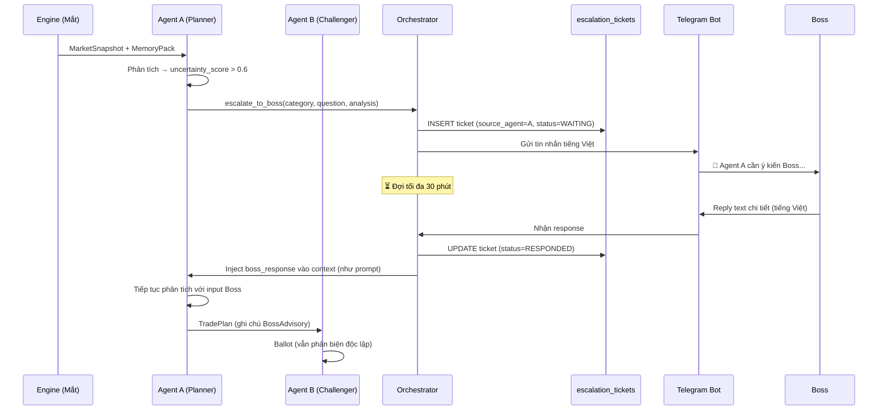
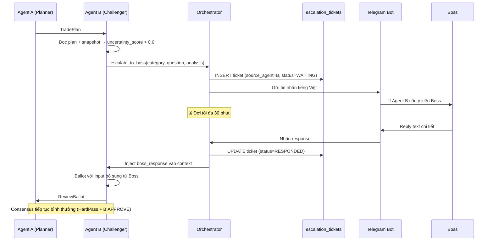
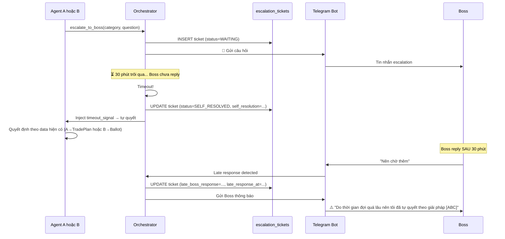
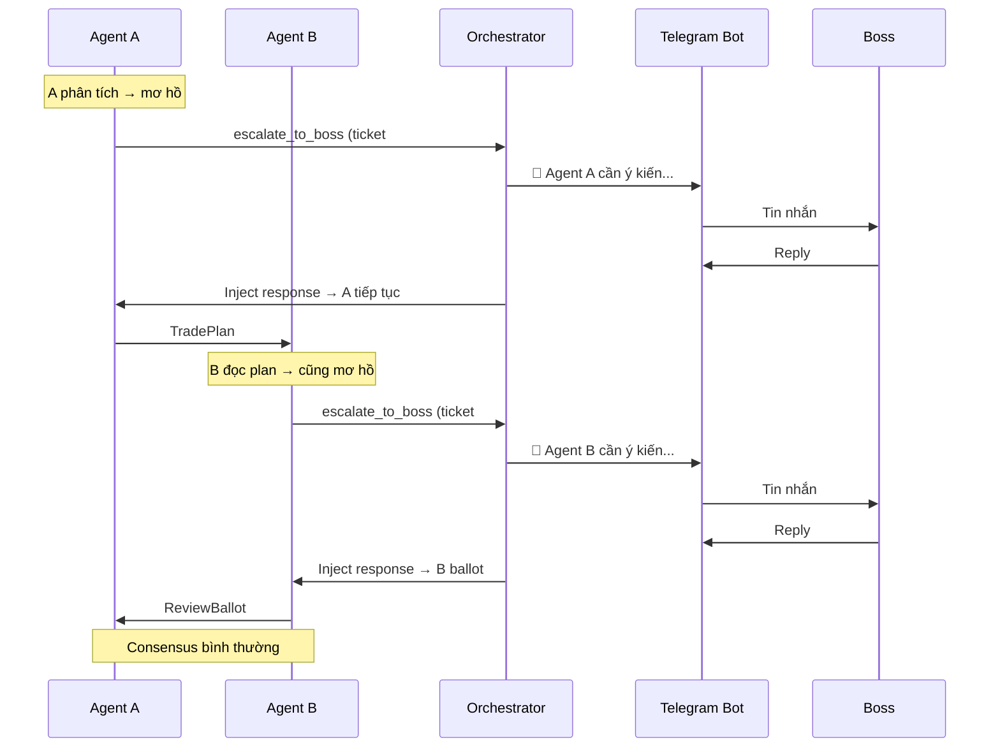

# 15 — Uncertainty Escalation (Agent → Boss via Telegram)

> **Tính năng mới:** Khi Agent A hoặc B **không tự tin** về phân tích trong bất kỳ giai đoạn nào (ENTRY, DCA, RECOVERY), chúng **chủ động gửi tin nhắn Telegram cho Boss** để hỏi ý kiến trước khi quyết định.

## 1. Mục tiêu & Triết lý

### 1.1 Vấn đề

Hệ thống hiện có 2 cơ chế liên quan Boss:

| Cơ chế | Hướng | Mô tả |
|--------|-------|-------|
| BossWake ([§11](11-boss-interrupt-flow.md)) | Boss → Agent | Boss **chủ động** đánh thức agents → hội đồng 3 bên |
| SYSTEM_FREEZE Alert ([§04 §8](04-message-schemas.md)) | System → Boss | Alert khi LLM outage |

**Thiếu:** Cơ chế agents **chủ động hỏi Boss** khi mơ hồ — luồng **ngược** (Agent → Boss) trong quá trình phân tích bình thường.

### 1.2 Giải pháp

Thêm cơ chế **Uncertainty Escalation** — Agent A hoặc B tự phát hiện mơ hồ → gửi Telegram → đợi Boss reply → tiếp tục xử lý.

### 1.3 Triết lý

- **Mơ hồ thì hỏi** — không giới hạn tần suất, đây là giá trị cốt lõi
- **Boss chỉ advisory** — response là input bổ sung, không override consensus
- **Agent nhận reply như prompt bình thường** — xử lý tự nhiên, không cần format đặc biệt
- **Ngôn ngữ tiếng Việt** — Agent nhắn và Boss reply đều bằng tiếng Việt
- **Timeout 30 phút** — Agent tự quyết nếu Boss không reply, thông báo Boss kết quả

## 2. Quyền escalate NGANG HÀNG

> **Agent A và Agent B có quyền escalate NGANG HÀNG.** Cả hai đều dùng chung cơ chế: gửi Telegram → đợi 30 phút → Boss reply hoặc tự quyết. Không có "ưu tiên" hay "luồng phụ".

| Agent | Khi nào escalate |
|-------|-----------------|
| **Agent A** | Khi phân tích MarketSnapshot + MemoryPack → mơ hồ về action (DCA hay WAIT? ENTRY hay chờ?) |
| **Agent B** | Khi nhận TradePlan của A → mơ hồ về việc APPROVE hay CHALLENGE (evidence hai bên đều có lý) |

## 3. Trigger Conditions

Agent escalate khi `uncertainty_score > 0.6`. Các category mơ hồ:

| Category | Mô tả | Ví dụ |
|----------|-------|-------|
| `CONFLICTING_SIGNALS` | D1 và H1 nói ngược nhau | D1 UPTREND nhưng H1 PUSH_DOWN mạnh |
| `MEMORY_CONFLICT` | MemoryPack có bài AVOID liên quan nhưng không chắc áp dụng | Bài AVOID "cản D1 mạnh" nhưng giá vẫn cách cản 15 pip |
| `NEAR_RESISTANCE` | Gần vùng cản/hỗ trợ D1 mạnh, không rõ phản ứng | Giá sát swing high D1, DCA hay WAIT? |
| `UNUSUAL_PATTERN` | Pattern bất thường chưa từng gặp | Nến H1 body cực lớn + volume spike |
| `RECOVERY_RISK` | RECOVERY rủi ro cao, lot đã lớn | TotalLot = 0.5, adverse squeeze tiếp, DCA thêm rủi ro margin |

## 4. Luồng chi tiết

### 4.1 Luồng 1 — Agent A mơ hồ, Boss reply đúng giờ (≤ 30 phút)



### 4.2 Luồng 2 — Agent B mơ hồ khi ballot, Boss reply đúng giờ (≤ 30 phút)



### 4.3 Luồng 3 — Timeout 30 phút → Agent tự quyết (áp dụng cho CẢ A lẫn B)



### 4.4 Luồng 4 — Cả A và B đều mơ hồ trong cùng 1 cycle



## 5. DB Schema — `escalation_tickets`

Bảng thứ 10 trong `dca_<symbol>.db`. Xem chi tiết tại [10-sqlite-design.md](../doc_phuong_phap/10-sqlite-design.md).

### Lifecycle

```
WAITING → RESPONDED      (Boss reply ≤ 30 phút)
WAITING → SELF_RESOLVED  (Timeout 30 phút → Agent tự quyết)
    └→ late_boss_response được ghi nếu Boss reply sau đó
```

### Schema tóm tắt

```sql
CREATE TABLE escalation_tickets (
    ticket_id         TEXT PRIMARY KEY,
    symbol            TEXT NOT NULL,
    source_agent      TEXT NOT NULL CHECK(source_agent IN ('A', 'B')),
    pair_state        TEXT NOT NULL,
    category          TEXT NOT NULL,
    uncertainty_score REAL NOT NULL,
    context_summary   TEXT NOT NULL,    -- tiếng Việt
    question          TEXT NOT NULL,    -- tiếng Việt
    analysis_so_far   TEXT,            -- JSON
    status            TEXT NOT NULL DEFAULT 'WAITING'
                      CHECK(status IN ('WAITING', 'RESPONDED', 'SELF_RESOLVED')),
    created_at        TEXT NOT NULL,
    timeout_at        TEXT NOT NULL,    -- created_at + 30 phút
    responded_at      TEXT,
    resolved_at       TEXT,
    boss_response     TEXT,
    self_resolution   TEXT,
    late_boss_response TEXT,
    late_response_at  TEXT,
    telegram_message_id INTEGER,
    plan_id           TEXT
);
```

## 6. Timeout & Fallback

| Tình huống | Hành vi |
|------------|---------|
| Boss reply ≤ 30 phút | Inject response vào Agent context → tiếp tục |
| Boss không reply sau 30 phút | Agent **tự quyết** theo data hiện có + ghi `SELF_RESOLVED` |
| Boss reply **sau** 30 phút | Ghi `late_boss_response` + nhắn Boss: "Do thời gian đợi quá lâu nên tôi đã tự quyết theo giải pháp [ABC]" |

## 7. Tần suất — Không giới hạn

> **Không có** `MaxEscalationsPerDay` hay `MinEscalationInterval`. Agent mơ hồ thì cứ hỏi.

Lý do: Escalation là giá trị cốt lõi của hệ thống HITL. Giới hạn tần suất = ép Agent quyết định khi chưa sẵn sàng = rủi ro.

## 8. Nguyên tắc bất biến

1. **Boss KHÔNG override** — response chỉ là input bổ sung
2. **B.APPROVE + HardPass** vẫn bắt buộc để enqueue
3. **Agent B phản biện độc lập** kể cả có ý kiến Boss
4. **Agent nhận boss response như prompt bình thường** — không cần structured format
5. **Phương pháp cứng không bị vi phạm** — kể cả Boss gợi ý ngược

## 9. Ví dụ Scenarios

### 9.1 ENTRY — D1 UP nhưng gần cản mạnh (Agent A escalate)

```
Tình huống:
- State: FLAT
- D1: UPTREND, nhưng giá đang sát swing high D1 (cản mạnh 0.9250)
- H1: PUSH_DOWN score = 0.72 → theo matrix = BUY
- MemoryPack: Có bài AVOID "Không entry khi giá sát cản D1 mạnh"

Agent A mơ hồ:
- Matrix nói BUY, nhưng bài AVOID nói không entry gần cản
- uncertainty_score = 0.75 → escalate!

Câu hỏi cho Boss:
"Giá AUDCAD đang sát cản D1 0.9250. Matrix nói BUY nhưng có bài AVOID 
cản D1 mạnh. Boss cho ý kiến: Entry BUY hay WAIT chờ phản ứng tại cản?"
```

### 9.2 DCA NORMAL — Spacing đủ nhưng streak dài (Agent A escalate)

```
Tình huống:
- State: NORMAL (2 lệnh BUY, TotalLot = 0.10)
- Spacing đủ (19 pip > 15 min)
- H1: 5 nến xuống liên tục (gần DQ_STREAK)
- MemoryPack: Có bài AVOID "streak > 4 đâm vào cản"

Agent A mơ hồ:
- Spacing đủ, DCA hợp lệ về kỹ thuật
- Nhưng streak dài + bài AVOID → rủi ro
- uncertainty_score = 0.68 → escalate!

Câu hỏi cho Boss:
"Spacing đủ để DCA BUY 0.10 nhưng H1 đang streak 5 nến xuống liên 
tục. Có bài AVOID streak. Boss cho ý kiến: DCA hay WAIT?"
```

### 9.3 RECOVERY — Lot lớn, adverse squeeze tiếp (Agent B escalate)

```
Tình huống:
- State: RECOVERY (TotalLot = 0.45, BUY)
- Adverse squeeze: PUSH_DOWN mạnh, spacing đủ
- Agent A đề xuất: RECOVERY_DCA BUY 0.20 (ladder step 4)
- TotalLot sẽ tăng lên 0.65 → margin pressure

Agent B mơ hồ khi ballot:
- A đề xuất hợp lệ về phương pháp (adverse squeeze + spacing đủ)
- Nhưng TotalLot 0.65 rất lớn, rủi ro margin
- uncertainty_score = 0.72 → escalate!

Câu hỏi cho Boss:
"Agent A đề xuất RECOVERY_DCA thêm 0.20 lot BUY. TotalLot sẽ tăng 
lên 0.65. Spacing đủ, adverse squeeze hợp lệ nhưng rủi ro margin 
cao. Boss cho ý kiến: APPROVE DCA hay CHALLENGE để WAIT?"
```

## 10. Audit Trail

Mọi escalation được ghi đầy đủ vào:
- **`escalation_tickets`** table: ticket_id, timestamps, status, response
- **`audit_log`**: event_type = `ESCALATION_SENT`, `BOSS_REPLIED`, `SELF_RESOLVED`, `LATE_REPLY`

## 11. Liên kết

- Telegram Bot Design: [16-telegram-bot-design.md](16-telegram-bot-design.md)
- Message Schemas: [04-message-schemas.md](04-message-schemas.md) §10, §11, §12
- Boss Interrupt (chiều ngược): [11-boss-interrupt-flow.md](11-boss-interrupt-flow.md)
- Autonomy Constraints: [10-autonomy-constraints.md](10-autonomy-constraints.md)
- Parameters: [../doc_phuong_phap/08-parameters.md](../doc_phuong_phap/08-parameters.md) §10
- DB Schema: [../doc_phuong_phap/10-sqlite-design.md](../doc_phuong_phap/10-sqlite-design.md) §2.9
- Diagram: [diagrams/A09-uncertainty-escalation.mmd](diagrams/A09-uncertainty-escalation.mmd)
