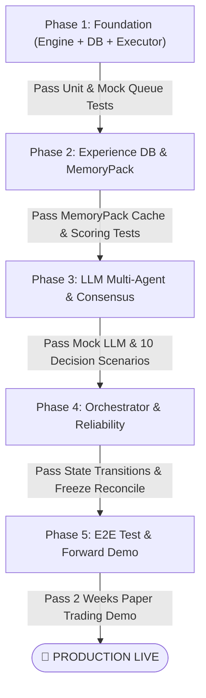

# Developer Coding Roadmap — Hướng Dẫn & Lộ Trình Lập Trình

> **Tài liệu kim chỉ nam cho Developer:** Phân bổ toàn bộ quá trình phát triển hệ thống **Trading Agent DCA (Python + MT5 + LLM Agents)** thành 5 Phase rõ ràng, tuần tự, kèm checklist cụ thể và chiến lược kiểm thử End-to-End.

---

## 🎯 1. Triết Lý & Nguyên Tắc Lập Trình Cốt Lõi

Trước khi viết bất kỳ dòng code nào, mọi developer tham gia dự án **BẮT BUỘC** nắm vững các nguyên tắc bất biến:

1. **Nguyên tắc ALL-LLM (DEC-01-NEW):**
   - **MỌI** hành động thay đổi vị thế (`ENTRY`, `DCA`, `RECOVERY_DCA`, `PAYOFF_REDUCE`, `CLOSE_ALL`, `PARTIAL_CLOSE`, kể cả `WAIT`) **bắt buộc** phải do Agent A đề xuất + Agent B phản biện → Consensus → HardValidator → Enqueue.
   - **Không có bất kỳ rule cứng tự động kiểu EA** nào được tự ý phát sinh lệnh.
2. **Phân Tách Rõ Ràng 3 Tầng (Mắt - Não - Tay):**
   - **Engine (Mắt):** Cảm biến + máy tính dữ liệu (tính swing, score, spacing, snapshot). **Tuyệt đối không ra lệnh.**
   - **LLM Agents (Bộ Não):** Người duy nhất có quyền quyết định giao dịch dựa trên snapshot và bài học kinh nghiệm.
   - **Executor Thread (Tay):** Công nhân cơ khí, chỉ claim lệnh `PENDING` từ SQLite và gửi `OrderSend` sang MT5.
3. **Operations Reliability & SYSTEM_FREEZE (DEC-08):**
   - Khi LLM API gặp sự cố (timeout, 5xx, rate limit) → Chuyển `SYSTEM_FREEZE = true`, đóng băng toàn bộ hành vi, alert Boss. **Không tự động chuyển về rule-only (No Auto-Degrade).**
   - Khi LLM phục hồi → Auto-resume kèm **Light Reconcile** (so khớp trạng thái MT5 vs Database).
4. **DCA Timing (DEC-09):**
   - `ENTRY` neo theo nến H1 đóng.
   - `DCA` được xét ở **mỗi lần wake C3 (dynamic intra-bar)** và H1 close: Khi giá chạm `spacing_met`, A+B phân tích và quyết định ngay giữa nến, không chờ H1 close.
5. **Mô Hình Per-Instance 1 Symbol = 1 Process (ADR-001):**
   - Mỗi cặp tiền chạy trên 1 tiến trình Python riêng biệt (`python src/main.py --symbol <SYM>`), sở hữu 1 file database riêng (`dca_<symbol>.db` với `PRAGMA synchronous = FULL`), 1 scheduler riêng, 1 freeze monitor riêng và 1 executor thread riêng.
   - Thêm cặp mới = thêm cấu hình trong `symbols.yaml` + chạy thêm 1 process (Zero Core Code Modification).
6. **Không Repaint:**
   - Mọi tính toán chỉ đọc nến đã đóng (`shift >= 1`). Cấm dùng `shift = 0`.

---

## 🗺️ 2. Danh Mục Tài Liệu Lộ Trình (doc_flow_code)

| File | Nội dung chính | Phase tương ứng |
|---|---|---|
| [README.md](README.md) | Tổng quan lộ trình, cấu trúc thư mục, tech stack và quy ước code | Toàn bộ |
| [01-architecture-and-project-structure.md](01-architecture-and-project-structure.md) | Cấu trúc code Python chuẩn Senior, Full File Tree, Pydantic Models, Protocol Interfaces, ADR-001 CLI | Chuẩn bị |
| [02-phase-1-foundation-engine-db.md](02-phase-1-foundation-engine-db.md) | SQLite 9 bảng + WAL + Repositories, MT5 Adapter (retry/comment/normalize), Structure/Signal/Position Submodules, HardValidator, Executor | **Phase 1** |
| [03-phase-2-experience-db-system.md](03-phase-2-experience-db-system.md) | Xây dựng `experience.db`, LessonWriter (Single-writer), MemoryPack Builder 2 tầng, Deduplication SHA256 | **Phase 2** |
| [04-phase-3-llm-agents-consensus.md](04-phase-3-llm-agents-consensus.md) | LLM Providers (DeepSeek/OpenAI/Anthropic), Agent A (Planner), Agent B (Challenger), Consensus Engine, Boss Channel, `LLMRuns` logging | **Phase 3** |
| [05-phase-4-orchestrator-operations.md](05-phase-4-orchestrator-operations.md) | Single-symbol Runner, Scheduler C0 (H1 close + 2s) & C3 (DCA timing), SYSTEM_FREEZE & Light Reconcile, Startup Reconcile, Monitoring | **Phase 4** |
| [06-phase-5-e2e-testing-and-deployment.md](06-phase-5-e2e-testing-and-deployment.md) | Historical Replay Harness, Paper Trading Demo 2 tuần, Multi-process Windows VPS Deployment (PowerShell/NSSM) | **Phase 5** |
| [07-developer-checklist-and-definition-of-done.md](07-developer-checklist-and-definition-of-done.md) | Master Checklist từng Phase, Definition of Done (DoD), Pre-flight Live deployment checklist | Nghiệm thu |

---

## ⏱️ 3. Lộ Trình Phát Triển 5 Phase (Milestones)

---

## 🛠️ 4. Tech Stack & Công Cụ Phát Triển

- **Ngôn ngữ:** Python 3.11+
- **Kết nối sàn:** `MetaTrader5` official Python package
- **Cơ sở dữ liệu:** SQLite3 (WAL mode, busy_timeout=5000, Foreign Keys ON)
- **Data Validation & Typing:** Pydantic v2 / Python `dataclasses`
- **LLM Clients:** `openai`, `anthropic`, hoặc REST client tương thích OpenAI (DeepSeek-V3)
- **Testing Framework:** `pytest`, `pytest-asyncio`, `pytest-mock`
- **Lập lịch & Quản trị:** `asyncio` / standard threading
- **Logging & Audit:** `loguru` / standard `logging` xuất file JSONL xoay vòng
