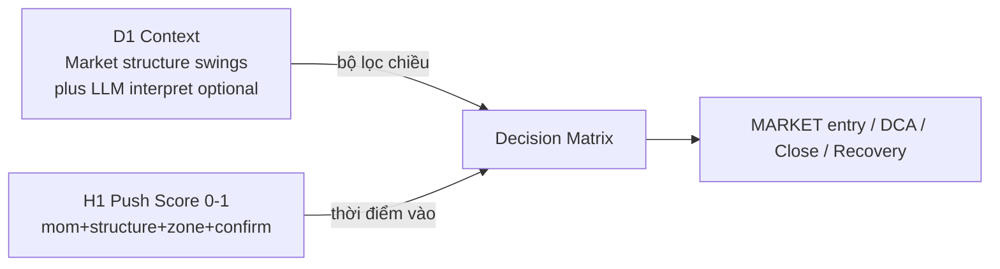

# 01 — System Overview

## 1. Mục tiêu hệ thống

Xây dựng **Trading Agent DCA** dạng Expert Advisor (MQL5) tự động:

- Theo dõi **4 cặp cố định**: `AUDCAD`, `AUDNZD`, `GBPUSD`, `NZDCAD`.
- Dùng **D1** làm bộ lọc bối cảnh (cấu trúc giá); **H1** làm tín hiệu ép giá (Strength Score).
- Quản lý vốn theo **ladder lot + spacing ATR**; khi tổng lot vượt ngưỡng → chế độ **RECOVERY** đến khi sạch lệnh.
- Mỗi cặp có **state machine độc lập**: `FLAT → NORMAL → RECOVERY → FLAT`.

## 2. Triết lý giao dịch



| Tầng | Timeframe | Vai trò |
|------|-----------|---------|
| Context | D1 (nến đã đóng) | Cấu trúc giá (swing/BOS) → UPTREND / DOWNTREND / SIDEWAY; **không** ADX/EMA |
| Timing | H1 (nến vừa đóng) | Strength Score 0–1 + verdict PUSH_UP/DOWN (≥0.6 vào matrix) |
| Execution | Ngay tại H1 close | MARKET order; không chờ nến tiếp theo |

**Buy the dip / Sell the rally / Fade extremes** — phụ thuộc context (xem [04-decision-matrix.md](04-decision-matrix.md)).

## 3. Phạm vi (In Scope)

| Hạng mục | Chi tiết |
|----------|----------|
| Platform | MetaTrader 5, MQL5 EA |
| Symbols | Đúng 4 cặp nêu trên |
| TF | Chỉ D1 + H1 cho quyết định |
| Order type | Market (entry, DCA, payoff); partial/full close |
| States | FLAT, NORMAL, RECOVERY |
| Alerts | Tùy chọn khi vào/ra RECOVERY, kill-switch |
| Kill-switch | Thủ công (input / chart button / global variable) |

## 4. Ngoài phạm vi (Out of Scope) — giai đoạn design

| Hạng mục | Ghi chú |
|----------|---------|
| Code MQL5 | Chưa viết trong phase này |
| Max drawdown auto-stop | **Cấm** dừng theo DD; chỉ clear lệnh hoặc kill-switch |
| Max lot ceiling | **Không** có trần lot tối đa |
| Pending / limit / stop entry | Không dùng cho entry tín hiệu |
| Multi-timeframe khác (M15, H4…) | Không dùng cho decision core |
| LLM tự bịa swing / thay HardValidator | Cấm — LLM chỉ diễn giải swing deterministic (Phase 2 A2A) |

## 5. Kiến trúc logic mức cao

```
┌─────────────────────────────────────────────────────────────┐
│                     EA Orchestrator                         │
│  OnTick → detect NewBar H1 → for each Symbol: PairAgent     │
└───────────────┬─────────────────────────────────────────────┘
                │
    ┌───────────┼───────────┬──────────────┬──────────────────┐
    ▼           ▼           ▼              ▼                  ▼
 Context     Signal      Decision      PositionMgr        RiskGate
 Engine      Engine      Matrix        (open/DCA/         (kill-switch,
 (D1)        (H1)        + State       close/partial)     direction lock,
                         Machine                          cooldown)
```

Mỗi `PairAgent` giữ:

- `Context`, `PrevContext` (cho hysteresis)
- `State` ∈ {FLAT, NORMAL, RECOVERY}
- `BasketDir`, `TotalLot`, `LastEntryPrice` / `WorstAdversePrice`
- `LadderStep` (bậc lot hiện tại)
- `CooldownUntilBar`

## 6. Mô hình vận hành đa cặp

| Chế độ | Tham số | Hành vi |
|--------|---------|---------|
| Độc lập (default) | `InpGlobalDirectionLock = false` | Mỗi cặp tự có `BasketDir`; 4 agent song song |
| Global lock (optional) | `InpGlobalDirectionLock = true` | Khi bất kỳ cặp nào đang `BUY`/`SELL`, cặp khác **không** được mở hướng ngược global |

Định nghĩa lock (design):

```
GlobalDir = NONE | BUY | SELL
  := suy ra từ tập BasketDir của các cặp đang có lệnh

Nếu GlobalDirectionLock AND GlobalDir != NONE:
  Cặp FLAT chỉ được OPEN cùng chiều GlobalDir
```

## 7. Constraints hệ thống (khóa cứng)

1. **4 cặp cố định** — không mở rộng symbol trong runtime.
2. **D1 + H1 only** cho context/signal.
3. **Market tại H1 close** — không delay sang bar sau cho entry tín hiệu.
4. **Mỗi cặp 1 hướng** tại một thời điểm (`BasketDir` duy nhất).
5. **Không max drawdown stop** — RECOVERY chạy đến `TotalLot == 0`.
6. **Kill-switch thủ công** là cơ chế dừng khẩn cấp duy nhất ngoài clear lệnh tự nhiên.
7. **Không repaint** — chỉ `shift ≥ 1`.

## 8. Vòng đời tài liệu → code

```
Design Doc (đây) → Duyệt 4 Mermaid diagrams → Spec freeze
    → Implement MQL5 EA + inputs
    → Strategy Tester backtest (4 symbols)
    → Forward / demo → Live
```

Xem diagram tổng thể chu kỳ: [diagrams/D01-lifecycle-cycle.mmd](diagrams/D01-lifecycle-cycle.mmd).  
Xem sơ đồ dữ liệu: [diagrams/D04-data-architecture.mmd](diagrams/D04-data-architecture.mmd).
