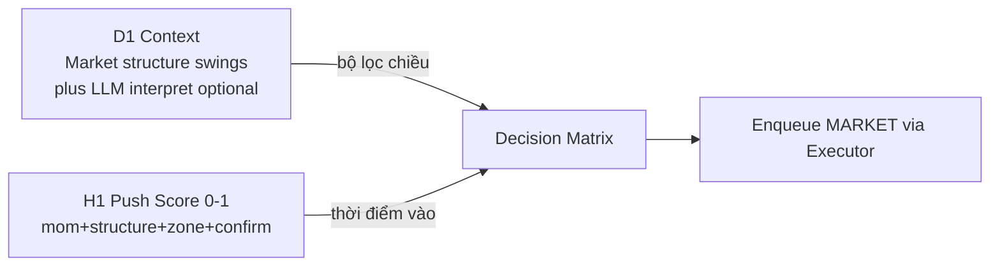

# 01 — System Overview

## 1. Mục tiêu hệ thống

Xây dựng **Trading Agent DCA** trên **Python Engine** + MetaTrader 5 API:

- 4 cặp cố định độc lập: `AUDCAD`, `AUDNZD`, `GBPUSD`, `NZDCAD`.
- D1 = bối cảnh cấu trúc giá; H1 = Strength Score ép giá.
- Ladder lot + spacing ATR; RECOVERY khi `TotalLot ≥ R_TH` đến khi sạch.
- State: `FLAT → NORMAL → RECOVERY → FLAT`.
- LLM Agents (A/B) quyết định → **queue `MarketOrderInfo`** → Executor OrderSend ([`doc_agents`](../doc_agents/)).

## 2. Triết lý giao dịch



| Tầng | Timeframe | Vai trò |
|------|-----------|---------|
| Context | D1 đã đóng | Swing/BOS → ContextFinal; **không** ADX/EMA |
| Timing | H1 đã đóng | Strength Score; PUSH≥0.6 vào matrix |
| Execution | Sau consensus | INSERT queue → Executor → MT5 |

**Buy the dip / Sell the rally / Fade extremes** — [04-decision-matrix.md](04-decision-matrix.md).

## 3. Phạm vi (In Scope)

| Hạng mục | Chi tiết |
|----------|----------|
| Platform | Python engine + MT5 API + SQLite + LLM agents |
| Symbols | 4 cặp nêu trên |
| TF | D1 + H1 |
| Order | Market qua Executor queue |
| States | FLAT, NORMAL, RECOVERY |
| Kill-switch | Config / flag thủ công |

## 4. Ngoài phạm vi

| Hạng mục | Ghi chú |
|----------|---------|
| Code production | Chưa trong phase design |
| Max DD auto-stop | Cấm |
| Max lot ceiling | Không |
| LLM bịa swing | Cấm |

## 5. SAFETY RAILS vs HardValidator

| Thuật ngữ | Định nghĩa |
|-----------|------------|
| **HardValidator** | Deterministic trong engine, **5 checks**: (1) matrix action hợp lệ, (2) spacing/ladder đúng, (3) RECOVERY cấm mở ngược, (4) NormalizeLot theo bước broker, (5) kill-switch. FAIL → không enqueue. |
| **SAFETY RAILS** | Bao trùm: HardValidator + hysteresis D1 + ngưỡng PUSH (Enter=0.6, Ignore=0.4) + soft-zone WAIT + LLM veto clamp. |

## 6. Soft zone H1

```
strength_final < 0.4           → bỏ qua (NEUTRAL)
0.4 ≤ strength_final < 0.6     → WAIT + log "soft zone (chất lượng yếu)" — không entry
strength_final ≥ 0.6           → đủ vào Decision Matrix
```

## 7. Kiến trúc logic mức cao

```
Python Instance / symbol
  Eyes (Structure + StrengthScore) → Snapshot
  Agents A/B (+ MemoryPack) → HardValidator
  → INSERT MarketOrderInfo PENDING
  → Executor Thread → MT5
  → PairState / Audit / Experience feedback
```

Chi tiết: [11-python-engine-notes.md](11-python-engine-notes.md), [10-sqlite-design.md](10-sqlite-design.md).

## 8. Đa cặp

| Chế độ | Default | Hành vi |
|--------|---------|---------|
| Độc lập | `GlobalDirectionLock=false` | Mỗi cặp `BasketDir` riêng |
| Global lock | optional true | FLAT chỉ OPEN cùng `GlobalDir` |

## 9. Constraints

1. 4 cặp cố định.  
2. D1+H1 only.  
3. Quyết định nghiệp vụ neo H1 close (không repaint).  
4. Mỗi cặp 1 hướng.  
5. Không max-DD stop.  
6. Kill-switch thủ công + clear lệnh.  
7. Agents không OrderSend trực tiếp.

## 10. Vòng đời tài liệu → code

```
Design Doc → Duyệt diagrams (D01–D09, A01–A08, E01–E03)
  → Spec freeze → Implement Python engine + agents
  → Forward / demo → Live
```

Diagrams: [D01](diagrams/D01-lifecycle-cycle.mmd), [D04](diagrams/D04-data-architecture.mmd), [D07](diagrams/D07-instance-architecture.mmd).
