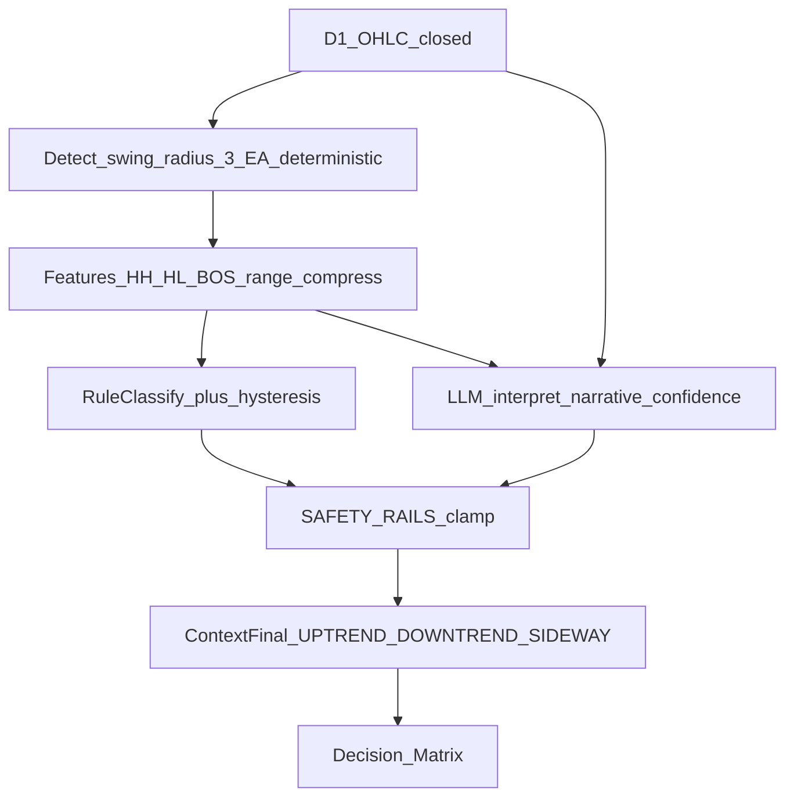

# 02 — D1 Context: Đọc cấu trúc giá kiểu mắt người

## 1. Triết lý

**KHÔNG** dùng ADX/EMA để quyết định bối cảnh D1.

Phương pháp: **market structure / price action** — “đôi mắt” (swing deterministic, EA tính, backtest được) + (phase agents) “bộ não” LLM diễn giải như trader → **SAFETY RAILS** → `Context` cuối ∈ {`UPTREND`, `DOWNTREND`, `SIDEWAY`}.

| Lớp | Tên | Ai làm | Phase |
|-----|-----|--------|-------|
| Mắt | Swing + đặc trưng cấu trúc | EA / engine **deterministic** | Phase 1 (backtest rule) |
| Não | Diễn giải lời + confidence | LLM (Agent A/B) | Phase 2 (A2A); shadow so sánh trước khi trao quyền |
| Ray | SAFETY RAILS + hysteresis | Rule engine | Mọi phase |

Ma trận quyết định vẫn: UPTREND → chỉ MUA (dip); DOWNTREND → chỉ BÁN (rally); SIDEWAY → fade (xem [04-decision-matrix.md](04-decision-matrix.md)).

## 2. (a) Swing point — “ĐÔI MẮT” (deterministic)

Chỉ trên nến D1 **đã đóng**. Bán kính pivot mặc định `InpSwingRadius = 3`.

### Pivot High tại nến `i` (confirmed)

```
High[i] > High[i+1], High[i+2], High[i+3]     // 3 nến TRƯỚC (shift lớn hơn = cũ hơn trong MT5: i+1..i+R)
High[i] > High[i-1], High[i-2], High[i-3]     // 3 nến SAU (mới hơn về phía hiện tại)
```

Quy ước index: dùng **series theo thời gian tăng** `bars[0..N-1]` với `bars[N-1]` = D1 đóng mới nhất, hoặc tương đương MT5 shift với cùng bán kính 3.

**Pivot chỉ XÁC NHẬN** sau khi đủ 3 nến D1 **sau** pivot đã đóng → không repaint.

### Pivot Low tại nến `i`

```
Low[i] < Low của 3 nến TRƯỚC và 3 nến SAU (bán kính 3)
```

### Bộ nhớ swing

```
Giữ tối đa InpMaxSwings = 6 swing đã confirm gần nhất (xen kẽ PH/PL theo thời gian)
Mỗi swing: { type: PH|PL, price, time, bar_index }
```

## 3. (b) Đặc trưng cấu trúc (EA tính sẵn → đưa LLM / rule)

Từ tối đa 6 swing gần nhất, engine xuất:

| Feature | Định nghĩa |
|---------|------------|
| `swing_list` | [(PH/PL, price, time), …] tối đa 6 |
| `HH/HL/LH/LL` | So PH gần nhất vs PH trước; PL gần nhất vs PL trước |
| `last_BOS` | **up-BOS**: nến D1 **đóng** > pivot high gần nhất; **down-BOS**: đóng < pivot low gần nhất; ghi loại + thời điểm BOS gần nhất |
| `range_compress` | `|swing_high_gần − swing_low_gần| / ATR14_D1[1]` |
| `price_vs_pivots` | Vị trí `Close[1]` so với các pivot gần (trên/dưới/trong range) |

`ATR14_D1` **chỉ** dùng đo nén / spacing tham chiếu — **không** phân loại bối cảnh bằng ATR đơn lẻ thay structure.

## 4. (c) Phân loại bối cảnh (ưu tiên, cấu hình được)

Cho `RuleContext` (Phase 1 deterministic / SAFETY RAILS baseline):

```
function ClassifyStructureContext(features, PrevContext):

  // UPTREND
  if last_2_PH form HH
     AND last_2_PL form HL
     AND không có down-BOS sau cấu trúc HH+HL đó:
        candidate = UPTREND

  // DOWNTREND
  else if last_2_PH form LH
     AND last_2_PL form LL
     AND không có up-BOS sau cấu trúc LH+LL đó:
        candidate = DOWNTREND

  // SIDEWAY
  else if range_compress <= InpRangeCompressMax   // default X = 1.5 × ATR
       OR cấu trúc vừa bị phá cả 2 chiều trong InpDualBreakLookbackBars
       OR không thỏa UPTREND/DOWNTREND:
        candidate = SIDEWAY
  else:
        candidate = SIDEWAY

  // Hysteresis — tránh lật lọng
  if candidate == PrevContext:
      return PrevContext
  if đủ xác nhận đổi:
      // HysteresisNeedTwoSwings: 2 swing cùng dấu liên tiếp
      // HOẶC HysteresisAllowStrongBOS: BOS ngược mạnh (≥ BosStrengthATR × ATR14_D1)
      return candidate
  else:
      return PrevContext   // giữ cũ
```

### Hysteresis (chi tiết)

| Tham số | Default | Ý nghĩa |
|---------|---------|---------|
| `InpHysteresisNeedTwoSwings` | `true` | Đổi context chỉ khi 2 swing cùng dấu liên tiếp xác nhận |
| `InpHysteresisAllowStrongBOS` | `true` | Cho phép đổi ngay nếu BOS ngược mạnh (close vượt pivot ≥ `InpBosStrengthATR` × ATR14_D1) |
| `InpRangeCompressMax` | `1.5` | `range_compress ≤ X` → nghiêng SIDEWAY |
| `InpDualBreakLookbackBars` | `10` | Cửa sổ phát hiện phá 2 chiều gần đây |

Khởi tạo: `PrevContext = SIDEWAY` nếu chưa có.

## 5. (d) Vai trò LLM — “BỘ NÃO” (Phase 2 / A2A)

### Input bắt buộc cho LLM

- 30 nến D1 OHLC đã đóng (mới nhất)
- Danh sách swing D1 (≤6) + đặc trưng mục (b) — **EA tính sẵn**
- Trạng thái rổ hiện tại (hướng, TotalLot, số lệnh, P/L, state)
- (Snapshot đầy đủ xem [doc_agents/12-market-data-fetch.md](../doc_agents/12-market-data-fetch.md))

### Output LLM

```json
{
  "context_d1": "UPTREND|DOWNTREND|SIDEWAY",
  "confidence": 0.0,
  "narrative": "giá tạo đỉnh thấp dần, vừa phá đáy gần nhất bằng nến đóng cửa mạnh → downtrend",
  "veto": false
}
```

### Quy tắc LLM

1. **KHÔNG** tự bịa swing point — chỉ diễn giải swing deterministic.  
2. Viết mô tả kiểu trader (narrative).  
3. Có thể **VETO** khi `confidence < InpLlmContextMinConf` (default `0.55`) hoặc cấu trúc mơ hồ → giữ `PrevContext` hoặc ép WAIT ở tầng quyết định.  
4. Quyết định cuối: **SAFETY RAILS** (rule mục c + hysteresis) **clamp** output LLM trước khi vào ma trận.

```
ContextFinal =
  if LLM.veto or LLM.confidence < MinConf:
      PrevContext   // hoặc SIDEWAY nếu policy chọn an toàn
  else:
      ClampToRails(LLM.context_d1, RuleContext, features, PrevContext)
```

`ClampToRails`: nếu LLM lệch quá xa rule (ví dụ rule=DOWNTREND rõ mà LLM=UPTREND) → ưu tiên rule Phase 1 hoặc yêu cầu Agent B challenge (A2A).

## 6. Snapshot gửi LLM mỗi H1 close (thay phần dữ liệu cũ)

1. 30 nến D1 OHLC đã đóng (mới nhất)  
2. 20–30 nến H1 OHLC đã đóng (mới nhất)  
3. Swing D1 ≤ 6 (loại/giá/thời gian)  
4. HH/HL/LH/LL, BOS gần nhất, range nén vs ATR14_D1  
5. Trạng thái rổ: hướng, TotalLot, số lệnh, P/L, FLAT/NORMAL/RECOVERY  
6. ATR14_H1 (spacing / biến động — **không** phân loại context)  
7. Tin tức/event nếu có  

## 7. Strong-trend cho spacing (thay ADX)

```
IsStrongTrend := ContextFinal ∈ {UPTREND, DOWNTREND}
                 AND last_BOS cùng hướng với trend
                 AND range_compress > InpRangeCompressMax
```

Dùng cho `InpSpacingCoefStrong` trong [05-capital-dca.md](05-capital-dca.md).

## 8. Flowchart pipeline (preview)



Diagram nguồn: [diagrams/D05-d1-structure-pipeline.mmd](diagrams/D05-d1-structure-pipeline.mmd) và A2A [../doc_agents/diagrams/A06-d1-context-pipeline.mmd](../doc_agents/diagrams/A06-d1-context-pipeline.mmd).
