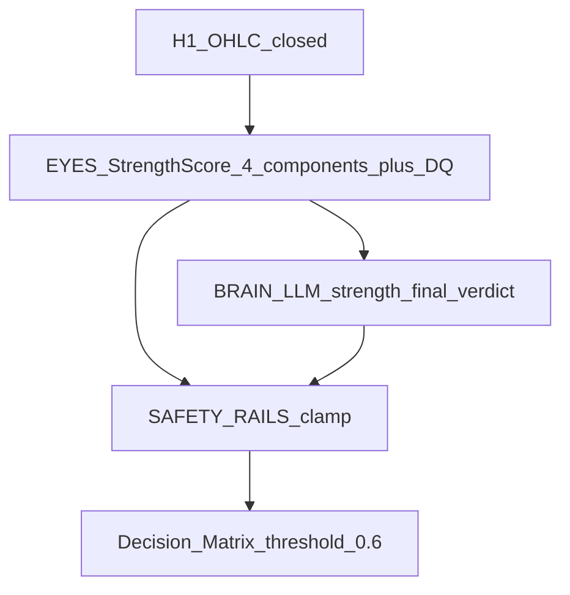

# 03 — H1 Push Strength Score (ép giá)

## 1. Nền tảng (giữ nguyên)

- Tín hiệu thời điểm = cú **ép giá** trên H1 tại nến H1 **ĐÓNG** (`H1[1]`).
- Không repaint: chỉ OHLC / pivot đã confirm trên nến đóng.

## 2. Cải tiến

Từ nhị phân (mạnh / không) → **điểm số 0–1** nhiều thành phần, đọc theo cấu trúc như mắt người — không chỉ 1 nến so ATR.

| Lớp | Tên | Ai | Phase |
|-----|-----|-----|-------|
| Mắt | H1 Strength Score + components + disqualifiers | EA deterministic | Phase 1 backtest |
| Não | strength_final, verdict, narrative, veto | LLM | Phase 2 A2A (shadow trước khi trao quyền) |
| Ray | SAFETY RAILS + ngưỡng ma trận | Rule | Mọi phase |

## 3. (a) ĐÔI MẮT — Strength Score 0–1 (deterministic)

Tính **hai hướng** riêng: `Score_UP` và `Score_DOWN` trên cùng nến đóng (thành phần body/breakout theo chiều tương ứng).  
`Score_raw` hướng thắng = max có hướng; sau disqualifier → `strength_score`.

Weights mặc định (cấu hình):

| Thành phần | Trọng số max | Ký hiệu |
|------------|--------------|---------|
| Momentum | 0.4 | `W_MOM` |
| Cấu trúc / breakout | 0.3 | `W_STR` |
| Vị trí (vùng) | 0.2 | `W_LOC` |
| Xác nhận thân nến | 0.1 | `W_CONF` |
| **Tổng** | **1.0** | |

### 3.1 Momentum (0–0.4)

```
body_atr = |C - O| / ATR14_H1[1]
K_S = InpStrongMult          // default 1.5 → full điểm
K_MIN = InpMomNormFloor      // default 0.5 → bắt đầu có điểm

mom_unit =
  if body_atr >= K_S: 1.0
  else if body_atr <= K_MIN: 0.0
  else: (body_atr - K_MIN) / (K_S - K_MIN)   // tuyến tính

Momentum = W_MOM * mom_unit
```

Chiều UP chỉ khi `C > O`; chiều DOWN khi `C < O`. Doji → momentum ≈ 0.

### 3.2 Cấu trúc / breakout (0–0.3)

```
N_B = InpBreakoutBars        // default 3
PriorHighMax = max High[2..1+N_B]
PriorLowMin  = min Low[2..1+N_B]

// Swing H1 mini — pivot bán kính InpH1SwingRadius=3, confirmed
NearestSwingHigh / NearestSwingLow
```

| Điều kiện | Điểm cộng (trong W_STR) |
|-----------|-------------------------|
| UP: `C > PriorHighMax` | +0.15 |
| UP: `C > NearestSwingHigh` (pivot H1) | +0.15 |
| DOWN: `C < PriorLowMin` | +0.15 |
| DOWN: `C < NearestSwingLow` | +0.15 |

Cộng dồn, clamp ≤ `W_STR` (0.3).

### 3.3 Vị trí / chất lượng vùng (0–0.2) — phụ thuộc Context D1

```
ATR_D1 = ATR14_D1[1]
near_zone = InpZoneNearATR * ATR_D1     // default 1.5
```

| Context D1 | Hướng ép | Cộng điểm vùng | Trừ điểm |
|------------|----------|----------------|----------|
| UPTREND | PUSH_DOWN (buy dip) | Giá gần swing **low D1** (≤ `near_zone`) | Ép DOWN giữa “hư không” (xa mọi swing D1) |
| DOWNTREND | PUSH_UP (sell rally) | Giá gần swing **high D1** | Ép UP giữa hư không |
| SIDEWAY | UP hoặc DOWN | Gần biên range D1 (swing high/low) | Giữa range, không biên |

```
Location = clamp(W_LOC * quality_unit, -InpWLocPenalty, W_LOC)
// InpWLocPenalty default = 0.2 (= W_LOC)
// quality_unit ∈ [-1, 1]; điểm âm khi ép sai vùng
```

Design: điểm vị trí có thể âm → trừ vào tổng trước clamp `[0,1]`.

### 3.4 Xác nhận (0–0.1)

```
range = H - L
body  = |C - O|
// Close gần cực trị thuận hướng (trong 20% dải)
UP clean:   C >= H - 0.2 * range
DOWN clean: C <= L + 0.2 * range

wick_against:
  UP:   upper_wick >= 0.4 * body
  DOWN: lower_wick >= 0.4 * body
```

| Điều kiện | Điểm |
|-----------|------|
| Close sạch gần cực trị | +0.1 |
| Bấc ngược ≥ 0.4×body (từ chối) | trừ (đánh dấu `reject_wick=true`, −0.1 hoặc hơn theo config) |

### 3.5 Disqualifiers — “không đuổi giá”

Trúng → **giảm mạnh** score (nhân `InpDqMult`, default `0.35`) hoặc ép `verdict_hint=EXHAUSTION` / WAIT:

| DQ | Điều kiện |
|----|-----------|
| `DQ_STREAK` | ≥ `InpMaxPushStreak` (default **4**) nến H1 liên tiếp cùng hướng với cú ép |
| `DQ_INTO_D1_WALL` | Cú ép chạy sát S/R D1 mạnh (≤ `0.5×ATR_D1`) mà **chưa** breakout bằng nến đóng cửa vượt pivot D1 |
| `DQ_NEWS` | Tin tức đang phát hành / biến động bất thường (nếu có data) |

```
strength_score = clamp(Momentum + Structure + Location + Confirm, 0, 1)
if any_disqualifier: strength_score *= InpDqMult   // hoặc floor về < PushIgnore
```

Xuất kèm **từng thành phần** + flags DQ cho LLM / audit.

## 4. (b) LLM — BỘ NÃO đọc cú ép

### Input

- 20–30 nến H1 OHLC đã đóng  
- `strength_score` + từng thành phần mục (a)  
- Swing H1 mini (≤6)  
- Vị trí vs swing D1 + `ContextFinal` (pipeline D1)  
- Trạng thái rổ  

### Output

```json
{
  "strength_final": 0.0,
  "verdict": "PUSH_UP|PUSH_DOWN|NEUTRAL|EXHAUSTION",
  "confidence": 0.0,
  "narrative": "nến đóng phá đỉnh 3 nến nhưng chạm cản D1 + bấc dài → ép yếu, cảnh giác đảo chiều",
  "veto": false
}
```

### Quy tắc

1. LLM **không** bịa OHLC / swing — chỉ diễn giải.  
2. Có thể **VETO** dù score cao nếu thấy EXHAUSTION / mơ hồ.  
3. `strength_final` + `verdict` qua **SAFETY RAILS** trước ma trận.

```
SignalEffective =
  if LLM.veto OR verdict==EXHAUSTION OR confidence < MinConf:
      NEUTRAL
  else if UseLlmSignal:
      strength = strength_final; verdict = LLM.verdict
  else:
      strength = strength_score
      verdict = (Score_UP>=Score_DOWN && strength>=InpPushEnter) ? PUSH_UP
              : (Score_DOWN>Score_UP && strength>=InpPushEnter) ? PUSH_DOWN
              : NEUTRAL

// Phase 1: UseLlmSignal=false — chỉ mắt + rails ngưỡng
```

## 5. (c) Ngưỡng dùng cho ma trận

```
InpPushEnter   = 0.6   // PUSH mạnh — đủ vào matrix OPEN
InpPushIgnore  = 0.4   // dưới này → bỏ qua (NEUTRAL)
// [0.4, 0.6) → zone mềm: WAIT (không entry)
```

| D1 Context | H1 PUSH_UP ≥ 0.6 | H1 PUSH_DOWN ≥ 0.6 |
|------------|------------------|---------------------|
| **UPTREND** | đứng chờ (**KHÔNG bán**) | **MUA** (chất lượng cao nếu chạm vùng) |
| **DOWNTREND** | **BÁN** (chất lượng cao nếu chạm vùng) | đứng chờ (**KHÔNG mua**) |
| **SIDEWAY** | **BÁN** (fade đỉnh) | **MUA** (fade đáy) |

Chi tiết implement: [04-decision-matrix.md](04-decision-matrix.md).

## 6. Dùng Signal theo state

| State | Điều kiện | Action |
|-------|-----------|--------|
| FLAT | Matrix với PUSH ≥ 0.6 | OPEN_* / WAIT |
| NORMAL | Favorable PUSH ≥ 0.6 + BasketProfit ≥ TpMoney | CLOSE_ALL |
| RECOVERY | Adverse PUSH ≥ 0.6 | RECOVERY_DCA |
| RECOVERY | Favorable PUSH ≥ 0.6 | PAYOFF_REDUCE |

| BasketDir | Favorable | Adverse |
|-----------|-----------|---------|
| BUY | PUSH_UP | PUSH_DOWN |
| SELL | PUSH_DOWN | PUSH_UP |

## 7. Alias tương thích doc cũ

```
STRONG_UP   ≈ PUSH_UP   ∧ strength_final ≥ InpPushEnter
STRONG_DOWN ≈ PUSH_DOWN ∧ strength_final ≥ InpPushEnter
NONE        ≈ NEUTRAL | EXHAUSTION | strength < InpPushIgnore | veto
```

## 8. Pipeline (preview)



Diagram: [diagrams/D06-h1-strength-pipeline.mmd](diagrams/D06-h1-strength-pipeline.mmd).
