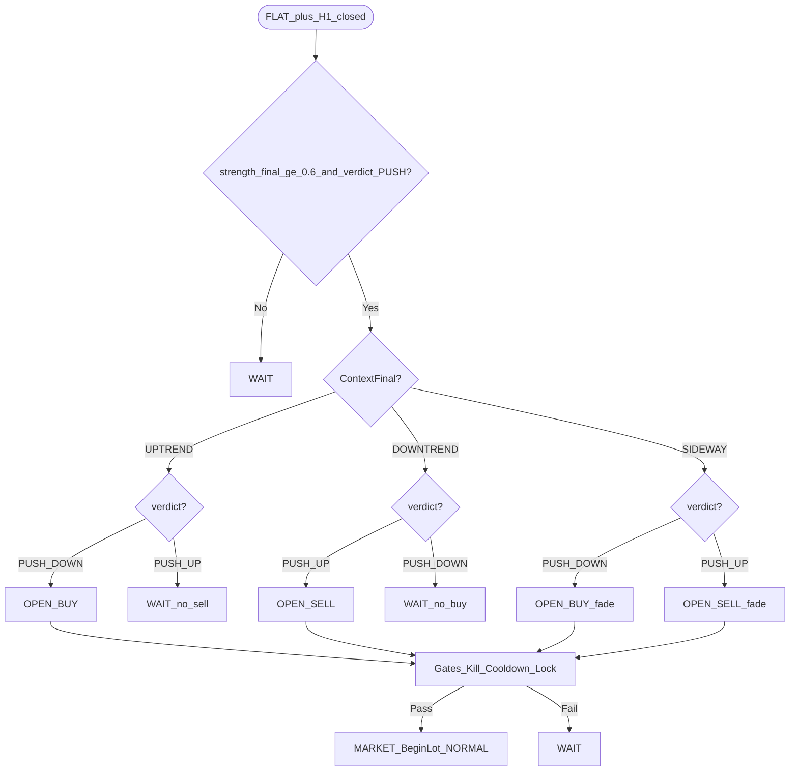

# 04 — Decision Matrix

## 1. Phạm vi áp dụng

Ma trận dùng khi cặp **FLAT** tại H1 đóng, sau khi đã có:

- `ContextFinal` ∈ {SIDEWAY, UPTREND, DOWNTREND} — pipeline D1 cấu trúc giá  
- `Push` = tín hiệu H1 sau rails: `verdict` + `strength_final`  
  - `PUSH_UP` / `PUSH_DOWN` chỉ khi `strength_final ≥ InpPushEnter` (default **0.6**)  
  - `strength_final < InpPushIgnore` (default **0.4**) hoặc `NEUTRAL` / `EXHAUSTION` / veto → coi như **không tín hiệu**

NORMAL / RECOVERY **không** mở hướng mới theo matrix (xem [06](06-state-machine.md), [07](07-recovery-loop.md)).

## 2. Ma trận (FLAT → Entry)

| Bối cảnh D1 | H1 `PUSH_UP` ≥ 0.6 | H1 `PUSH_DOWN` ≥ 0.6 | Khác / yếu |
|-------------|--------------------|----------------------|------------|
| **UPTREND** | Đứng chờ — **KHÔNG bán** (`WAIT`) | **MUA** buy dip (`OPEN_BUY`) — chất lượng cao nếu chạm vùng D1 | `WAIT` |
| **DOWNTREND** | **BÁN** sell rally (`OPEN_SELL`) — chất lượng cao nếu chạm vùng | Đứng chờ — **KHÔNG mua** (`WAIT`) | `WAIT` |
| **SIDEWAY** | **BÁN** fade đỉnh (`OPEN_SELL`) | **MUA** fade đáy (`OPEN_BUY`) | `WAIT` |

### Pseudo-code

```
function MatrixAction(Context, verdict, strength_final):
  if strength_final < InpPushIgnore:          # < 0.4
      return WAIT
  if strength_final < InpPushEnter:           # [0.4, 0.6)
      log("soft zone (chất lượng yếu)")
      return WAIT
  if verdict in {NEUTRAL, EXHAUSTION}: return WAIT

  if Context == UPTREND:
      if verdict == PUSH_DOWN: return OPEN_BUY
      else: return WAIT                              // không bán

  if Context == DOWNTREND:
      if verdict == PUSH_UP: return OPEN_SELL
      else: return WAIT                              // không mua

  if Context == SIDEWAY:
      if verdict == PUSH_UP: return OPEN_SELL
      if verdict == PUSH_DOWN: return OPEN_BUY

  return WAIT
```

## 3. Gates trước MARKET

| Kiểm tra | Pass | Fail |
|----------|------|------|
| Kill-switch | off | WAIT |
| Cooldown | hết | WAIT |
| FLAT / TotalLot==0 | yes | skip |
| GlobalDirectionLock | không conflict | WAIT |
| HardValidator | structure+score+matrix | WAIT |

Pass → `MARKET BeginLot` → `BasketDir` → `NORMAL`.

## 4. Global Direction Lock

Giữ như trước (`InpGlobalDirectionLock`, default false) — xem bản mô tả lock trong lịch sử doc / [01](01-system-overview.md).

## 5. Flowchart



## 6. Bảng Action codes

| Context × Push | Action |
|----------------|--------|
| UPTREND × PUSH_DOWN ≥0.6 | `OPEN_BUY` |
| UPTREND × PUSH_UP ≥0.6 | `WAIT` |
| DOWNTREND × PUSH_UP ≥0.6 | `OPEN_SELL` |
| DOWNTREND × PUSH_DOWN ≥0.6 | `WAIT` |
| SIDEWAY × PUSH_UP ≥0.6 | `OPEN_SELL` |
| SIDEWAY × PUSH_DOWN ≥0.6 | `OPEN_BUY` |
| * × yếu / NEUTRAL / EXHAUSTION | `WAIT` |

## 7. Liên kết

- Context D1: [02-d1-context.md](02-d1-context.md)  
- Score H1: [03-h1-signal.md](03-h1-signal.md)  
- Lifecycle: [diagrams/D01-lifecycle-cycle.mmd](diagrams/D01-lifecycle-cycle.mmd)  
