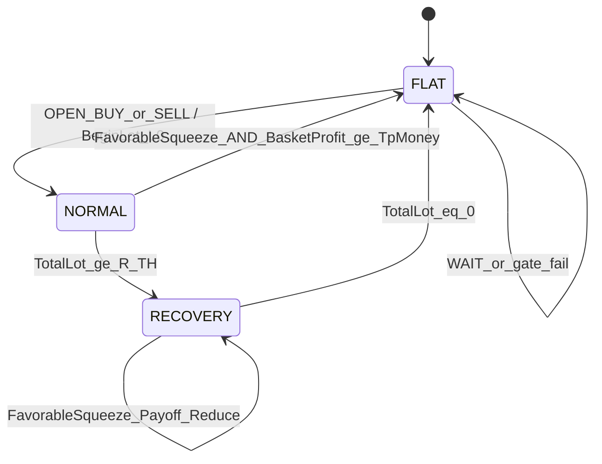

# 06 — Pair State Machine

## 1. Tổng quan

Mỗi cặp có **một** state machine độc lập:

```
FLAT ──(entry hợp lệ)──► NORMAL ──(TotalLot ≥ R_TH)──► RECOVERY ──(TotalLot == 0)──► FLAT
  ▲                         │                              │
  └──────(CLOSE_ALL TP)─────┘                              │
  └──────────────────────────(clear hết lệnh)──────────────┘
```

Diagram nguồn: [diagrams/D02-pair-state-machine.mmd](diagrams/D02-pair-state-machine.mmd).

## 2. Định nghĩa state

| State | Invariant | Cho phép |
|-------|-----------|----------|
| `FLAT` | `TotalLot == 0`, `BasketDir == NONE` | Chờ matrix entry |
| `NORMAL` | `0 < TotalLot < R_TH` | DCA cùng hướng; CLOSE_ALL theo basket TP |
| `RECOVERY` | `TotalLot ≥ R_TH` (cho đến khi về 0) | Adverse DCA; Favorable payoff+reduce; **cấm** mở ngược; **cấm** TP kiểu NORMAL |

`R_TH = InpRecoveryThresholdLot` (default `0.3`).

## 3. Biến trạng thái per symbol

| Biến | Kiểu | Mô tả |
|------|------|-------|
| `State` | enum | FLAT / NORMAL / RECOVERY |
| `Context` / `PrevContext` | enum | Bối cảnh D1 |
| `BasketDir` | BUY/SELL/NONE | Hướng rổ |
| `TotalLot` | double | Σ volume |
| `LadderStep` | int | Bậc lot hiện tại |
| `AdverseRef` | double | Giá tham chiếu DCA |
| `CooldownUntilBar` | datetime/long | Hết cooldown mới được entry |
| `EnteredRecovery` | bool | Để fire alert enter/exit một lần |

## 4. FLAT — chi tiết

### 4.1 Hành vi mỗi H1 close

```
1. Nếu KillSwitch → WAIT
2. Tính Context (D1[1]), Signal (H1[1])
3. Action = MatrixAction(Context, Signal)
4. Nếu Action ∈ {OPEN_BUY, OPEN_SELL}:
     kiểm tra Cooldown, GlobalLock, trade allowed
     nếu OK:
       MARKET BeginLot
       BasketDir = hướng
       LadderStep = 0
       State = NORMAL
       cập nhật AdverseRef
```

### 4.2 Transition ra

| Từ | Điều kiện | Đến | Side effects |
|----|-----------|-----|--------------|
| FLAT | `OPEN_BUY/SELL` thành công | NORMAL | `TotalLot = L0`, alert optional |
| FLAT | không tín hiệu / gate fail | FLAT | none |

### 4.3 Cooldown (optional)

```
InpUseCooldown = true/false (default false hoặc true — design: default false)
InpCooldownH1Bars = N (default 0 hoặc 3)

Khi CLOSE_ALL hoặc RECOVERY → FLAT:
  CooldownUntilBar = TimeCurrent_H1_index + InpCooldownH1Bars

Entry chỉ khi bar_index >= CooldownUntilBar
```

## 5. NORMAL — chi tiết

### 5.1 Invariant kiểm tra đầu cycle

```
Refresh TotalLot từ positions
Nếu TotalLot == 0 → State = FLAT (desync recovery)
Nếu TotalLot >= R_TH → State = RECOVERY (+ alert)
```

### 5.2 Nhánh A — DCA theo spacing

```
Tính SpacingPips / SpacingPrice (xem 05)
Nếu giá adverse đủ Spacing:
  lot = Lot(LadderStep + 1)
  MARKET cùng BasketDir
  LadderStep += 1
  cập nhật AdverseRef, TotalLot
  Nếu TotalLot >= R_TH:
    State = RECOVERY
    Alert("ENTER RECOVERY", symbol, TotalLot)
```

Điều kiện giá:

```
BUY:  Bid <= AdverseRef - SpacingPrice
SELL: Ask >= AdverseRef + SpacingPrice
```

### 5.3 Nhánh B — Chốt toàn bộ (Basket TP)

```
FavorableSqueeze =
  (BasketDir == BUY  AND verdict == PUSH_UP   AND strength_final >= InpPushEnter) OR
  (BasketDir == SELL AND verdict == PUSH_DOWN AND strength_final >= InpPushEnter)

BasketTpMoney = PipValue(symbol, lot=1) * TP_Pips * TotalLot
  // hoặc tương đương money của TP_Pips trên TotalLot

Nếu FavorableSqueeze AND BasketProfit >= BasketTpMoney:
  CLOSE_ALL positions magic+symbol
  State = FLAT
  BasketDir = NONE
  LadderStep = 0
  set Cooldown
```

### 5.4 Ưu tiên trong cùng 1 H1 bar (NORMAL)

Thứ tự xử lý khuyến nghị:

1. Refresh lot / desync check  
2. **Close basket TP** (nếu đủ điều kiện) — ưu tiên chốt trước DCA  
3. Else **DCA spacing**  
4. Cập nhật state theo `TotalLot`

### 5.5 Transitions

| Từ | Điều kiện | Đến |
|----|-----------|-----|
| NORMAL | `CLOSE_ALL` thành công | FLAT |
| NORMAL | sau DCA `TotalLot >= R_TH` | RECOVERY |
| NORMAL | vẫn `0 < TotalLot < R_TH` | NORMAL |

## 6. RECOVERY — chi tiết

Xem đầy đủ vòng lặp: [07-recovery-loop.md](07-recovery-loop.md) và [diagrams/D03-recovery-activity.mmd](diagrams/D03-recovery-activity.mmd).

### 6.1 Cấm tuyệt đối trong RECOVERY

| Cấm | Lý do |
|-----|-------|
| Mở hướng ngược `BasketDir` | Không hedge / không flip |
| `CLOSE_ALL` theo rule Basket TP kiểu NORMAL | Chỉ reduce qua payoff hoặc clear dần |
| Auto-stop theo max drawdown | Constraint hệ thống |
| Entry theo Decision Matrix | Matrix chỉ cho FLAT |

### 6.2 Hai nhánh tín hiệu

| Tín hiệu | Ý nghĩa với rổ | Action |
|----------|----------------|--------|
| Adverse squeeze | Ép ngược (BUY×PUSH_DOWN≥0.6; SELL×PUSH_UP≥0.6) | `RECOVERY_DCA` |
| Favorable squeeze | Ép thuận cùng ngưỡng | `RECOVERY_PAYOFF_REDUCE` |

### 6.3 Thoát RECOVERY

```
Sau mọi thao tác:
  TotalLot = Σ volume
  Nếu TotalLot == 0:
    State = FLAT
    BasketDir = NONE
    LadderStep = 0
    Alert("EXIT RECOVERY → FLAT")
    set Cooldown
  Else:
    State = RECOVERY   // kể cả khi TotalLot tạm < R_TH (design đã chốt)
```

**Quyết định thiết kế (đã chọn):** Một khi đã vào RECOVERY, **giữ RECOVERY** cho đến `TotalLot == 0`, **không** tụt về NORMAL dù lot giảm dưới `0.3`. Tránh flip-flop NORMAL↔RECOVERY và giữ rule “chỉ dừng khi sạch”.

## 7. Kill-switch

```
InpKillSwitch / chart button / GlobalVariable:
  Mode A: PAUSE — không mở lệnh mới, không DCA; vẫn cho phép manual
  Mode B: FLATTEN — đóng tất cả position do EA quản lý → mọi cặp FLAT

Design default khi bật kill-switch cứng: PAUSE + optional FLATTEN flag riêng
```

Kill-switch **không** phải transition tự động của state machine; nó override gates.

## 8. Bảng tổng hợp transition (đủ tham số)

| # | From | To | Điều kiện (công thức) | Tham số liên quan |
|---|------|-----|------------------------|-------------------|
| T1 | FLAT | NORMAL | Matrix=`OPEN_*` ∧ ¬Kill ∧ CooldownOK ∧ GlobalLockOK ∧ OrderOK | `L0`, Matrix, Cooldown |
| T2 | NORMAL | FLAT | FavorableSqueeze ∧ `BasketProfit ≥ TpMoney(TP_Pips, TotalLot)` ∧ CloseOK | `TP_Pips`, Signal |
| T3 | NORMAL | RECOVERY | Sau DCA/refresh: `TotalLot ≥ R_TH` | `R_TH=0.3` |
| T4 | RECOVERY | RECOVERY | AdverseSqueeze → DCA cùng hướng (lot ladder↑) | Spacing, Ladder |
| T5 | RECOVERY | RECOVERY | FavorableSqueeze → PayoffLot ∈ [15%,30%] TotalLot + reduce loser | PayoffPct |
| T6 | RECOVERY | FLAT | `TotalLot == 0` sau reduce/close | — |
| T7 | ANY | FLAT | KillSwitch FLATTEN hoặc desync `TotalLot==0` | KillSwitch |

## 9. State diagram (embedded preview)



Bản đủ nhãn tham số: file `.mmd` D02.
