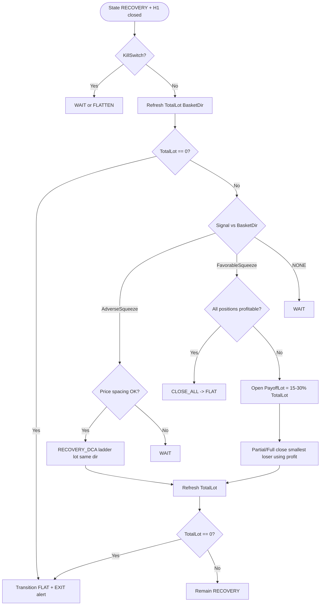

# 07 — RECOVERY Loop

## 1. Mục tiêu chế độ RECOVERY

Khi `TotalLot ≥ R_TH` (default `0.3`), agent chuyển sang **RECOVERY** và **lặp** cho đến khi sạch lệnh (`TotalLot == 0` → FLAT).

Triết lý:

- Giá **ép ngược** hướng rổ → **DCA thêm cùng hướng** (tăng lot, hạ/nâng giá trung bình).
- Giá **sập / ép thuận** → mở lệnh **payoff** cùng hướng để lấy **lãi**, dùng lãi đó **cắt/reduce** các lệnh lỗ (ưu tiên lệnh lỗ nhỏ nhất / gần giá nhất).
- Không đổi hướng, không TP kiểu NORMAL, không dừng theo drawdown.

Diagram: [diagrams/D03-recovery-activity.mmd](diagrams/D03-recovery-activity.mmd).

## 2. Định nghĩa Adverse vs Favorable

Cho `BasketDir` hiện tại:

| BasketDir | Adverse squeeze (ép ngược) | Favorable squeeze (ép thuận / sập theo hướng) |
|-----------|----------------------------|-----------------------------------------------|
| `BUY` | `PUSH_DOWN` ≥ PushEnter | `PUSH_UP` ≥ PushEnter |
| `SELL` | `PUSH_UP` ≥ PushEnter | `PUSH_DOWN` ≥ PushEnter |

```
AdverseSqueeze   = (BasketDir==BUY  AND verdict==PUSH_DOWN AND strength_final>=InpPushEnter)
                OR (BasketDir==SELL AND verdict==PUSH_UP   AND strength_final>=InpPushEnter)

FavorableSqueeze = (BasketDir==BUY  AND verdict==PUSH_UP   AND strength_final>=InpPushEnter)
                OR (BasketDir==SELL AND verdict==PUSH_DOWN AND strength_final>=InpPushEnter)
```

## 3. Vòng lặp mỗi H1 close (khi State == RECOVERY)

```
function RecoveryOnH1Close(symbol):
  if KillSwitch: return

  RefreshPositions → TotalLot, BasketDir
  if TotalLot == 0:
      TransitionToFlat(alert=EXIT_RECOVERY)
      return

  Context = ClassifyD1()          // vẫn cập nhật để log / spacing coef
  Signal  = DetectH1Signal()

  if AdverseSqueeze:
      DoRecoveryDca()
  else if FavorableSqueeze:
      DoPayoffAndReduce()
  else:
      // NONE: không hành động (hoặc optional spacing DCA — design: KHÔNG DCA nếu thiếu squeeze)
      WAIT

  Refresh TotalLot
  if TotalLot == 0:
      TransitionToFlat(alert=EXIT_RECOVERY)
  // else remain RECOVERY even if TotalLot < R_TH
```

**Quyết định thiết kế:** Trong RECOVERY, DCA **chỉ** khi có AdverseSqueeze (không DCA “câm” chỉ vì spacing), để khớp mô tả “Giá ép NGƯỢC → DCA”. Spacing vẫn dùng để **validate** khoảng cách tối thiểu trước khi DCA adverse (tránh spam cùng vùng giá).

## 4. Nhánh A — RECOVERY_DCA (ép ngược)

### 4.1 Điều kiện

```
AdverseSqueeze == true
AND khoảng cách giá so AdverseRef >= SpacingPrice
    (BUY: Bid <= AdverseRef - SpacingPrice
     SELL: Ask >= AdverseRef + SpacingPrice)
AND ¬KillSwitch
```

### 4.2 Hành động

```
lot = Lot(LadderStep + 1)     // tiếp tục ladder 0.05, 0.10, ...
MARKET cùng BasketDir
LadderStep += 1
TotalLot tăng
cập nhật AdverseRef
Alert optional: RECOVERY_DCA
```

### 4.3 Spacing trong RECOVERY

```
Coef = InpSpacingCoefStrong   // default 0.7 (dense hơn khi ép ngược)
SpacingPips = max(S_MIN, Coef × ATR_Pips)
```

## 5. Nhánh B — RECOVERY_PAYOFF_REDUCE (ép thuận)

### 5.1 Điều kiện

```
FavorableSqueeze == true
AND ¬KillSwitch
AND có ít nhất 1 position đang lỗ (floating loss < 0)   // nếu tất cả đang lãi: có thể CLOSE_ALL luôn → FLAT
```

**Edge — toàn bộ đang lãi:**

```
Nếu FavorableSqueeze AND BasketProfit >= 0 AND mọi lệnh ≥ 0:
  CLOSE_ALL → FLAT
  (không cần payoff)
```

### 5.2 Tính PayoffLot

```
pct = clamp(InpPayoffLotPct, InpPayoffLotPctMin, InpPayoffLotPctMax)
      // default pct=0.20; min=0.15; max=0.30

PayoffLot = NormalizeLot( TotalLot × pct )
```

### 5.3 Mở lệnh payoff

```
MARKET cùng BasketDir với volume = PayoffLot
Chờ khớp (market)
Gọi lệnh này là PayoffPosition (đánh dấu comment "PAYOFF")
```

Mục tiêu: lệnh payoff mở theo hướng thuận của cú ép → thường có **lãi tức thì hoặc nhanh** trên impulse; dùng P/L dương để bù đóng lệnh lỗ.

### 5.4 Reduce — chọn lệnh lỗ để cắt

Thứ tự ưu tiên (design đã chọn):

1. Lọc positions cùng symbol+magic, `profit < 0`
2. Sắp xếp theo **|loss| tăng dần** (lỗ nhỏ nhất trước) — “đóng lệnh lỗ nhỏ nhất”
3. (Tie-break) gần giá hiện tại nhất / ticket cũ hơn

```
function SelectLoserToCut():
  return argmin_{p in losers} |p.profit|     // lỗ nhỏ nhất về tiền
```

### 5.5 Cơ chế cắt bằng lãi

**Mode thiết kế mặc định: `PROFIT_FUNDED_PARTIAL`**

```
profit_pool = max(0, PayoffPosition.profit) + optional_buffer_from_other_winners

target = SelectLoserToCut()
Nếu không có loser → đóng payoff nếu muốn gọn rổ; refresh → nếu TotalLot==0 FLAT

volume_to_close = min(
  target.volume,
  VolumeAffordableBy(profit_pool, target)   // ước lượng volume có thể đóng mà “hòa” từ profit_pool
)

Nếu InpRecoveryReduceMode == FULL_LOSER_IF_COVERED:
  nếu profit_pool >= |target.profit|:
    close toàn bộ target
    optionally partial/close payoff để chốt lãi còn lại
  else:
    partial close target với volume_to_close
else:  // ALWAYS_PARTIAL_MIN_LOT
  partial close ít nhất min_lot trên target
```

**Đơn giản hóa implement khuyến nghị (phase 1 code sau này):**

```
1) Mở PayoffLot cùng hướng khi FavorableSqueeze
2) Ngay trong cùng cycle (sau khi có giá khớp):
   - Chọn loser lỗ nhỏ nhất
   - Nếu Payoff.profit + (optional) sum(winners.profit) >= |loser.profit|:
       Close toàn bộ loser
   - Else:
       Partial close loser với tỷ lệ profit_pool / |loser.profit_per_full|
3) Nếu Payoff vẫn mở và đã xong reduce: giữ payoff như 1 position thường trong rổ
   (TotalLot đã gồm PayoffLot — net: tăng rồi giảm sau close loser)
```

> Lưu ý accounting: mở payoff **tăng** `TotalLot` trước; đóng loser **giảm** `TotalLot`. Net thường giảm nếu đóng được loser ≥ payoff (không bắt buộc). Mục tiêu dài hạn là mài dần về 0.

### 5.6 Lặp

Mỗi H1 close tiếp theo lặp lại A/B cho đến `TotalLot == 0`.

## 6. Alerts

| Sự kiện | Alert |
|---------|-------|
| Vào RECOVERY (T3 từ NORMAL) | `ENTER_RECOVERY` + symbol + TotalLot |
| Mỗi RECOVERY_DCA | optional |
| Mỗi PAYOFF_REDUCE | optional |
| Ra FLAT từ RECOVERY | `EXIT_RECOVERY` + symbol |
| Kill-switch | `KILL_SWITCH` |

`InpAlertOnRecoveryEnterExit = true` (default).

## 7. Activity flowchart (preview)



## 8. So sánh NORMAL vs RECOVERY

| Khía cạnh | NORMAL | RECOVERY |
|-----------|--------|----------|
| Điều kiện vào | `TotalLot < R_TH` sau entry | `TotalLot ≥ R_TH` |
| DCA trigger | Spacing adverse (mọi lúc đủ khoảng) | Adverse **squeeze** + spacing |
| Chốt lãi | Basket TP khi favorable squeeze + đủ tiền | Không dùng TP 30-pip rule; payoff+reduce hoặc close-all nếu toàn lãi |
| Đổi hướng | Không | Không |
| Thoát | TP close → FLAT; hoặc lên RECOVERY | Chỉ khi `TotalLot==0` (hoặc kill flatten) |
| Dưới R_TH sau reduce | N/A | **Vẫn RECOVERY** đến khi = 0 |

## 9. Ràng buộc & rủi ro (ghi chú thiết kế)

- Không trần lot → RECOVERY có thể phình lot rất lớn; phụ thuộc margin broker.
- Không DD stop → operator phải dùng kill-switch.
- Payoff tăng lot tạm thời — cần đủ margin trước khi mở payoff.
- Mọi công thức volume phải `NormalizeLot` theo `SYMBOL_VOLUME_STEP`.
